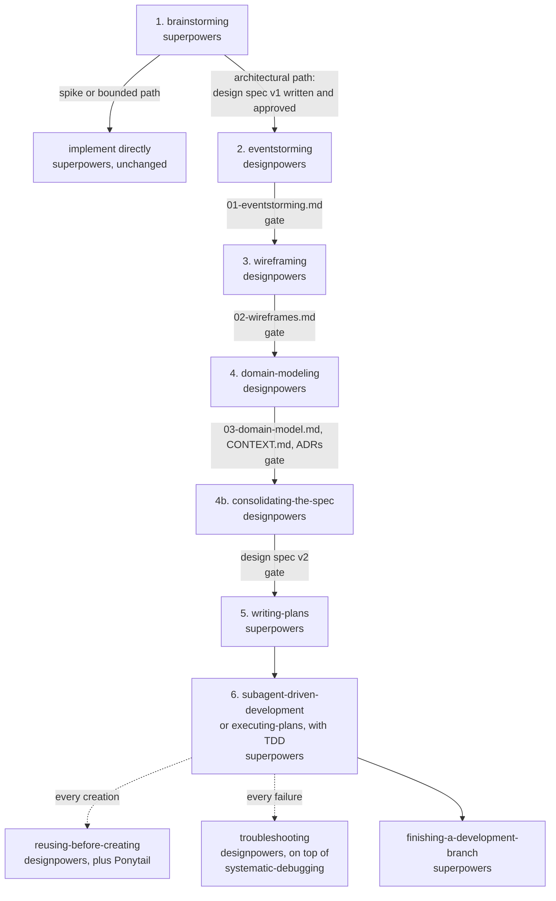

# The Designpowers workflow

Designpowers extends Superpowers with design stages between an approved design spec and
the implementation plan. This document is the map. Each stage is a skill with its own
`SKILL.md` under `plugins/designpowers/skills/`.

## The flow



## The level loop

Every stage has levels. Every level runs the same loop, and a level is not agreed until
the loop closes:

1. **Playback.** The agent restates what it understood in at most five sentences, in the
   words of the domain.
2. **Model.** A diagram. Mermaid in the file, ASCII in the conversation.
3. **Numbers.** A KPI table next to the model: sizes, frequencies, targets, limits.
   Estimates are marked `estimate`.
4. **Gate.** The user confirms. Decisions and open questions go into the artifact. Only
   then the next level starts.

The user and the agent understand each other through a model and through numbers. A model
shows the shape. Numbers show the size and the success condition. Prose alone proves
nothing.

## The stages

| Stage | Skill | Input | Output | Levels | Gate criterion | Hands off to |
|---|---|---|---|---|---|---|
| 1 | `superpowers:brainstorming` | the idea | design spec v1 | Superpowers' own | user reviews the spec | `designpowers:eventstorming` (redirected) |
| 2 | `designpowers:eventstorming` | design spec v1 | `01-eventstorming.md`, glossary entries | timeline, process, use cases | use case table with priorities and success KPIs | `designpowers:wireframing` |
| 3 | `designpowers:wireframing` | use case table | `02-wireframes.md` | screen map, flows, sketches | one flow per must use case with unhappy paths; data, inputs and rules listed | `designpowers:domain-modeling` |
| 4 | `designpowers:domain-modeling` | 01, 02 | `03-domain-model.md`, `CONTEXT.md`, ADRs | contexts, aggregates, entities | every command and event in one aggregate; invariants with IDs | `designpowers:consolidating-the-spec` |
| 4b | `designpowers:consolidating-the-spec` | v1, 01, 02, 03 | design spec v2, in place | one | user approves v2; no blocking question | `superpowers:writing-plans` |
| 5 | `superpowers:writing-plans` | design spec v2 | implementation plan | Superpowers' own | user picks the execution mode | `superpowers:subagent-driven-development` or `executing-plans` |
| 6 | Superpowers execution + TDD | plan | code, tests | per task | tests green, review done | `superpowers:finishing-a-development-branch` |

Cross-cutting:

| Skill | When | What it adds |
|---|---|---|
| `designpowers:using-designpowers` | injected at every session start | the routing rule, the level loop, the artifact map |
| `designpowers:reusing-before-creating` | before any creation, in a plan or a diff; its summary is injected into every subagent | a five-step search gate, a preference order, a three-line discovery note |
| `designpowers:troubleshooting` | on any failure | feedback loop first, tool map, evidence table, runbook, session numbers |
| Ponytail | every coding task | the YAGNI ladder, minimal code |

## Numbers per stage

| Stage | Numbers the user confirms |
|---|---|
| eventstorming | frequency and peak per event; actors and how often they act; volume and latency per command; priority and success KPI per use case |
| wireframing | places new and changed; steps, inputs, error paths, target time and completion rate per use case; fields, actions, rules per screen |
| domain-modeling | events and commands per context; messages per relationship; instances, writes per day, invariants per aggregate; attributes, cardinality, lifetime per entity |
| consolidating-the-spec | success KPIs with baseline, target and measurement point; size table; volume table; confirmed against estimated numbers |
| troubleshooting | time to red loop, reproduction rate, boundaries with evidence, hypotheses tested, time to root cause |

## Artifacts

```
docs/superpowers/specs/YYYY-MM-DD-<topic>-design.md   design spec: v1 by brainstorming, v2 by consolidating-the-spec
docs/superpowers/plans/YYYY-MM-DD-<topic>.md          implementation plan, by writing-plans
docs/designpowers/YYYY-MM-DD-<topic>/01-eventstorming.md
docs/designpowers/YYYY-MM-DD-<topic>/02-wireframes.md
docs/designpowers/YYYY-MM-DD-<topic>/03-domain-model.md
CONTEXT.md                                            ubiquitous language (or CONTEXT-MAP.md plus one per context)
docs/adr/NNNN-<slug>.md                               decisions that are hard to reverse
docs/troubleshooting.md                               runbook and tool map of the project
```

Every artifact has a Decisions table, an Open questions table and a Handoff checklist.
What is agreed at a gate is written before the next level starts. The conversation is not
the record.

## How the redirect works

Superpowers' `brainstorming` ends its architectural path with "Invoke the writing-plans
skill. Do NOT invoke any other skill." Designpowers does not fork Superpowers. Three
layers redirect that one hand-off:

1. The plugin's `SessionStart` hook injects `using-designpowers`, which quotes that
   sentence and states what it means here.
2. `CLAUDE.md` states the same rule. Superpowers says user instructions win over skills.
3. The `eventstorming` skill description triggers on an approved design spec.

The path is recognized by its artifact: a design spec file under `docs/superpowers/specs/`
means the path was architectural. `tests/scenarios/01-redirect.md` records the pressure
test.

## Agents

The `ranu` plugin ships the lead-orchestrator output style and seven agents: `architect`
(Opus), `deep-reviewer` (Opus, high effort), `Explore` (Sonnet), `implementer` (Sonnet),
`locator` (Haiku), `researcher` (Sonnet), `troubleshooter` (Sonnet). The output style
carries the stage-to-agent matrix and the team size by complexity table. The design stages
run in the main conversation; subagents collect facts.

## Dependencies

| Dependency | Source | Role |
|---|---|---|
| Superpowers | `superpowers@claude-plugins-official` | brainstorming, writing-plans, execution, TDD, debugging method |
| Ponytail | `ponytail@ponytail` | YAGNI ladder on every coding task |
| `comprehensive-review` | `claude-code-workflows` (wshobson/agents) | `full-review` for the final branch review |
| `incident-response` | `claude-code-workflows` | `smart-fix` reference pipeline for troubleshooting |
| `c4-architecture` | `claude-code-workflows` | documents an existing system before domain modeling on brownfield |

Optional, installed per project with `npx skills add`: `WH-2099/mermaid-skill` (23
diagram types, synced from the Mermaid docs) and `cheriftj/c4-model-skill` (Simon Brown's
rules and review checklist).

## Tests

`tests/scenarios/` holds one pressure scenario per skill: the documents to load, the
prompt, the expected behavior, the counter cases, and a result log. Run a scenario by
giving a fresh subagent the listed documents and the prompt, then compare with the
expected section. Record the run in the log.
