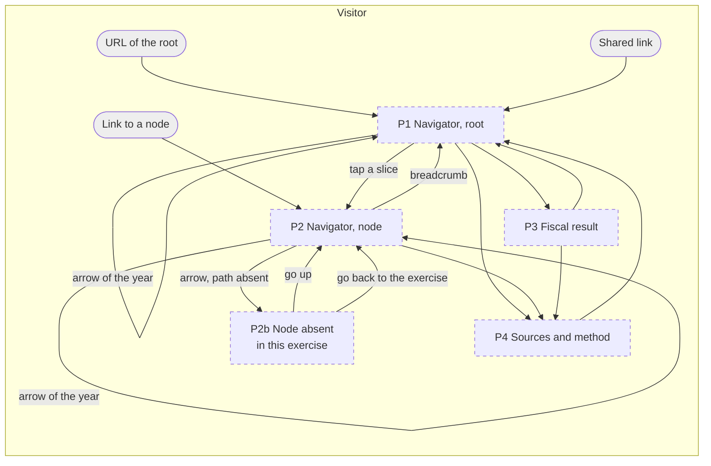
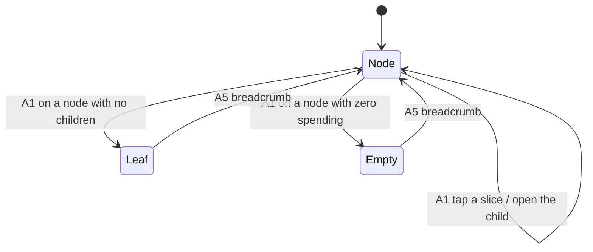
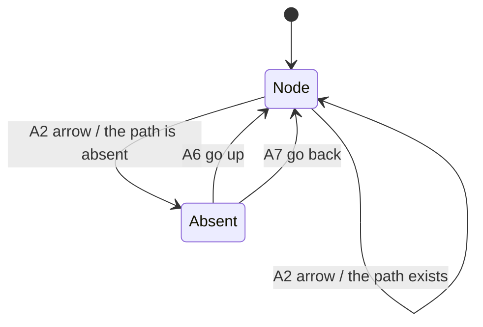

# Wireframes: the public spending navigator

EventStorming: **skipped**. The user skipped `designpowers:eventstorming` on
2026-09-15. Level 0 of this file derives the actors and the use cases from the
design spec, and marks them as derived.
Design spec: `docs/superpowers/specs/2026-09-14-public-spending-navigator-design.md`
Status: level 1 confirmed, level 2 confirmed, level 3 confirmed

## Context

One actor has an interface: the visitor. The product has no login, so the
citizen, the journalist and the researcher are the same actor. Every use case
below gets a flow.

## Level 0: derived inputs

`designpowers:wireframing` needs a use case table and an actor list from
eventstorming. That stage did not run. These come from the design spec.

| UC | Use case | Priority |
|---|---|---|
| UC-01 | See what the state spent in the last closed exercise | must |
| UC-02 | Go one level down on a slice | must |
| UC-03 | Open the slice "otros" | must |
| UC-04 | Change the exercise with the arrows | must |
| UC-05 | Go up, and know the current position | must |
| UC-06 | Know the source of a number and its date | must |
| UC-07 | See the fiscal result of the exercise | should |
| UC-08 | Share a link to the current view | should |

UC-06 is a `must` and not a `should`. The only asset of this product is that
its numbers are the numbers of the state. A product that cannot show that has
nothing.

## Level 1: screen map

### Playback

The visitor arrives at the navigator, which shows the last closed exercise. For
UC-02 and UC-03 the visitor stays in the navigator and changes the path. For
UC-04 the visitor stays and changes the exercise. For UC-07 the visitor goes to
the fiscal result and comes back. Nothing leaves the product.

### Model



### Numbers

| Actor | Places today | Places new | Places changed | Entry points |
|---|---|---|---|---|
| Visitor | 0 | 5 | 0 | 3 |

| Place | Serves use cases | Expected visits per day | Type |
|---|---|---|---|
| P1 Navigator, root | UC-01, 04, 07, 08 | 100 relative, estimate | screen |
| P2 Navigator, node | UC-02, 03, 05, 08 | 40 to 60 relative, estimate | screen |
| P2b Node absent | UC-04 | 2 to 5 relative, estimate | screen |
| P3 Fiscal result | UC-07 | 10 to 20 relative, estimate | screen |
| P4 Sources and method | UC-06 | 2 to 5 relative, estimate | screen |

The numbers are relative weights and not visits. The product does not exist, so
an absolute number would be an invention. **All estimates.**

### Gate

Confirmed by the user on 2026-09-15. The user made two changes: the fiscal
result gets its own place, and every number shows its source. The second change
removed a place, because a source that is always visible needs no screen.

## Level 2: flows

### UC-01 See the last closed exercise

**Playback.** The visitor opens the URL and lands on P1. The screen shows the
exercise, the total, the part that the state executed, the pie chart and the
fiscal result. The visitor types nothing.

```
PLACE: P1 Navigator, root
  (no affordance, the place loads)  -> PLACE: P1
```

| Path | Covered | Lands on |
|---|---|---|
| Validation error | Not applicable, the product collects no input | - |
| Empty state | Yes, an exercise with no execution | P1 with the message |
| No permission | Not applicable, the product has no login | - |
| Timeout or external failure | Yes, E1 | P1 with the last known data and its date |

### UC-02 Go one level down

**Playback.** The visitor at P1 or P2 taps a slice. The build already removed
the nodes with one child, so the new place is the first node that divides. The
breadcrumb grows with every name that the build removed.

```
PLACE: P1 or P2
  A1  a slice of the pie  -> read the node -> PLACE: P2
```



| Path | Covered | Lands on |
|---|---|---|
| Validation error | Not applicable | - |
| Empty state | Yes, E4, a node with zero spending | P2 with "no execution" |
| No permission | Not applicable | - |
| Timeout or external failure | Not applicable below the root. The institutional file is already in the browser | - |

### UC-03 Open the slice "otros"

**Playback.** The visitor taps the slice "otros". The slice is not a node of the
source. It is the group of the children below 4%. The new pie chart shows those
children, and their parts are a part of the total of "otros".

```
PLACE: P1 or P2
  A1  the slice "otros"  -> group the children below 4% -> PLACE: P2
```

The slice "otros" can hold another slice "otros". This happens in 21.2% of the
nodes. Only 8 nodes of the tree need more than 4 openings.

### UC-04 Change the exercise

**Playback.** The visitor taps the arrow. The exercise changes and the path
stays. If the path does not exist in the new exercise, the visitor lands on P2b,
which says so and offers two exits.

```
PLACE: P1 or P2
  A2  arrow left or right  -> change the exercise, keep the path
      path exists      -> PLACE: P2
      path absent      -> PLACE: P2b
PLACE: P2b
  A6  go up to the nearest ancestor that exists   -> PLACE: P2
  A7  go back to the exercise of origin           -> PLACE: P2
```



**The arrow changes the exercise and nothing else.** It does not move the
visitor in the tree. A rule that moves the exercise and the position at the same
time makes one action produce two changes.

Measured on the paths of 2025 against 2026:

| Level | Paths in 2025 | Survive in 2026 | Lost |
|---|---|---|---|
| jurisdiccion | 15 | 15 | 0% |
| entidad | 100 | 82 | 18% |
| servicio | 122 | 99 | 19% |
| programa | 489 | 316 | 35% |
| proyecto | 1,204 | 553 | 54% |
| actividad | 2,379 | 1,136 | 52% |

**P2b is not a rare screen.** Below the level of the programa the arrow finds an
absent path more than half of the time.

| Path | Covered | Lands on |
|---|---|---|
| Validation error | Not applicable | - |
| Empty state | Yes, the absent path | P2b |
| No permission | Not applicable | - |
| Timeout or external failure | Yes, E1, the file of the new exercise | P1 with the message |

### UC-05 Go up and know the position

**Playback.** The breadcrumb holds every name of the path, and it includes the
names that the build removed. The visitor taps one name and lands there.

```
PLACE: P2
  A5  a name of the breadcrumb  -> PLACE: P1 or P2
```

### UC-06 Know the source of a number

**Playback.** The source is a fixed line at the foot of every screen. It shows
the file and the date of publication. At the lowest node of a branch the line
opens and shows the codes that identify the rows.

```
PLACE: any
  A4  the line of the source  -> it opens with the exact codes
```

**The source goes down with the visitor.** High in the tree it names the file
and the date. Low in the tree it names the exact place. The slice "otros" shows
the file and the date of its siblings, because it reads the same file.

### UC-07 See the fiscal result

```
PLACE: P1
  A3  the panel of the fiscal result  -> PLACE: P3
```

### UC-08 Share a link

```
PLACE: any
  the URL holds the exercise and the path  -> a link that does not rot
```

The link carries its exercise, so a shared link always opens what its author
saw. Only the arrow crosses exercises.

### Numbers

| UC | Steps | Inputs typed | Places touched | Unhappy paths | Target time | Target completion | Drop-off risk at |
|---|---|---|---|---|---|---|---|
| UC-01 | 0 | 0 | 1 | E1 | 1.5 s to the pie chart | 100% | the first paint |
| UC-02 | 1 | 0 | 2 | E4 | **200 ms, no network** | 95% | a node with one child, if the build does not remove it |
| UC-03 | 1 | 0 | 1 | - | 200 ms | 95% | a second slice "otros" |
| UC-04 | 1 | 0 | 2 | E1, E3 | 400 ms | 90% | P2b, which is more than half of the taps at depth |
| UC-05 | 1 | 0 | 2 | - | 200 ms | 99% | a long breadcrumb on a telephone |
| UC-06 | 0 | 0 | 0 | - | always visible | - | - |
| UC-07 | 1 | 0 | 2 | E1 | 400 ms | 90% | - |
| UC-08 | 1 | 0 | 0 | E2 | 100 ms | 95% | - |

**The product collects no input on any screen.** This removes three of the four
unhappy paths that the method asks for: no validation error, no missing field,
no permission error.

The 200 ms of UC-02 come from the design spec. The institutional file is
already in the browser, so a movement inside the institutional axis touches no
network. **The built file weighs 177 KB after gzip, not the 113 KB that the
design estimated.** The build stores the five measures that the screens need.
See section 14 of `00-data-sources.md`.

### Gate

Confirmed by the user on 2026-09-15. The user chose the behaviour of the arrow:
it changes the exercise and nothing else, and an absent path gets its own screen
with two exits.

## Level 3: sketches

### P1 Navigator, root (new)

```
+--------------------------------------+
| <-2024   * 2025 closed   2026->   A2 |
|                                      |
| WHERE THE STATE SPENT IT             |
| 123.5 bill. - 96.1% executed         |
| +31% over the approved budget        |
|                                      |
|          pie chart                   |
|      Capital Humano 59.8%        A1  |
|      deuda 8.4% - economia 6.1%      |
|      salud 5.6% - ... - otros 5.6%   |
|                                      |
|  +-----------------------------+     |
|  | fiscal result    +11.3  A3  |     |
|  +-----------------------------+     |
+--------------------------------------+
| Source: Presupuesto Abierto          |
| credito-anual-2025 - 8 jul 2026 A4v  |
+--------------------------------------+
```

Data shown: exercise, state of the exercise, total `credito_devengado`, part of
`credito_vigente` executed, deviation against `credito_presupuestado`, the
children of level 1 with name and part, the fiscal result, the source file and
its date.
Inputs collected: none.
Rules enforced: group the children below 4% into the slice "otros"; an open
exercise shows the part executed.
Variants: loading; E1, the data does not arrive.

### P2 Navigator, node (new)

```
+--------------------------------------+
| <-2024    * 2025    2026->        A2 |
| < Inicio > Capital Humano         A5 |
|                                      |
| 73.8 bill. - 59.8% of the total      |
| +47% over the approved budget        |
|                                      |
|          pie chart                   |
|      Min. Cap. Humano 87.2%      A1  |
|      educacion 7.8% - ninez 3.6%     |
|      trabajo 1.5% - otros 5.0%       |
+--------------------------------------+
| Source: credito-anual-2025           |
| 8 jul 2026 - 9 codes            A4v  |
+--------------------------------------+
```

Data shown: the path, the total of the node, the part of the national total, the
deviation against the approved budget, the children with name and part, the
source, and the codes at the lowest node.
Inputs collected: none.
Rules enforced: group below 4%; the build removed the nodes with one child; the
breadcrumb holds the names that the build removed; the source shows the full
path of codes and never the visible path.
Variants: E4, a node with zero spending; a leaf with no children.

### P2b The node is absent in this exercise (new)

```
+--------------------------------------+
| <-2025    * 2026    2027->        A2 |
| < ... > Programa 21 > Actividad 21   |
|                                      |
|   "Actividad 21" does not exist in   |
|   the exercise 2026.                 |
|                                      |
|   It existed in 2025, with 1.2 bill. |
|                                      |
|  +-----------------------------+     |
|  | Go up to Programa 21    A6  |     |
|  +-----------------------------+     |
|    Go back to 2025           A7      |
+--------------------------------------+
| Source: credito-anual-2026           |
| 13 sep 2026                     A4v  |
+--------------------------------------+
```

Data shown: the path that the visitor asked for, the exercise, the name of the
absent node, and its value in the exercise of origin.
Inputs collected: none.
Rules enforced: the arrow changes the exercise and nothing else.
Variants: none.

### P3 Fiscal result (new)

```
+--------------------------------------+
| < Back                  2025      A5 |
|                                      |
| FISCAL RESULT 2025                   |
|   revenue           134.8            |
|   spending          123.5            |
|   -----------------------            |
|   surplus           +11.3            |
|                                      |
| HOW THE SPENDING GOT THERE           |
|  approved  ############    94.6      |
|  current   ##############  128.6     |
|  executed  #############   123.5 A1  |
|  paid      ############    121.1     |
|                                      |
|  BY JURISDICTION, AGAINST THE        |
|  APPROVED BUDGET                     |
|   Capital Humano           +47%      |
|   ...                                |
|   Desregulacion            -41%      |
+--------------------------------------+
| Sources: spending, revenue, and the  |
| official report - verified      A4v  |
+--------------------------------------+
```

Data shown: revenue, spending, the result, the four measures of the ladder, and
the deviation of every jurisdiction against the approved budget.
Inputs collected: none.
Rules enforced: this project computes the result and verifies it against the
official report; the screen shows the three numbers in order, because the
current budget explains the gap between the approved budget and the spending.
Variants: E1.

**The screen states the numbers and it does not interpret them.** To spend more
than the approved budget is not illegal. The modifications during the exercise
are a legal instrument, and the number "current budget" holds them. A screen
that shows the approved budget beside the spending, with no current budget
between them, accuses. A screen that shows the three informs.

### P4 Sources and method (new)

```
+--------------------------------------+
| < Back                            A5 |
|                                      |
| WHERE THESE NUMBERS COME FROM        |
|                                      |
| Presupuesto Abierto, Ministerio      |
| de Economia. Licence CC BY 4.0.      |
|                                      |
|  Exercise  File          Published   |
|  2024      credito-...   4 jul 2025  |
|  2025      credito-...   8 jul 2026  |
|  2026      credito-...  13 sep 2026  |
|                                      |
| +------------------------------+     |
| | Download from the official   |     |
| | site                     A8  |     |
| +------------------------------+     |
|                                      |
| Our total of 2025 equals the         |
| official total, to the peso.         |
+--------------------------------------+
```

Data shown: the source, the licence, the table of files with the date of
publication, and the state of the verification.
Inputs collected: none.
Rules enforced: none.
Variants: none.

### Numbers

| Place | Fields shown | Inputs | Primary action | Secondary actions | Rules enforced | Variants |
|---|---|---|---|---|---|---|
| P1 | 9 | 0 | A1 go down | A2, A3, A4 | 2 | 2 |
| P2 | 10 | 0 | A1 go down | A2, A4, A5 | 4 | 2 |
| P2b | 4 | 0 | A6 go up | A2, A4, A7 | 1 | 0 |
| P3 | 10 | 0 | A1 go to the pie chart | A4, A5 | 2 | 1 |
| P4 | 5 | 0 | A8 open the official file | A5 | 0 | 0 |

### Gate

Confirmed by the user on 2026-09-15. The user added the deviation against the
approved budget to P1, P2 and P3, because a state that spends more or less than
the budget of the Congress is the question that the product exists to answer.

## Data, inputs and rules for domain modeling

| Place | Data shown | Inputs | Rules, candidates for an invariant |
|---|---|---|---|
| P1 | Exercise, total devengado, total vigente, total presupuestado, children of level 1, fiscal result, source | none | The parts of the children add to the total of the parent. A child below 4% joins the slice "otros". |
| P2 | Node, its path, its four measures, its children, its source, its codes | none | The key of a node is the full path and never the last code. A node with one child is not a place. The breadcrumb holds the removed names. |
| P2b | The path asked for, the exercise, the value in the exercise of origin | none | A path exists in an exercise, or it does not. The arrow never changes the path. |
| P3 | The four measures of the exercise, the revenue, the result, the deviation per jurisdiction | none | presupuestado <= vigente. devengado <= vigente. pagado <= devengado. The result equals revenue minus spending, and it equals the official report. |
| P4 | The file per exercise, its date, the licence, the state of the verification | none | Every number belongs to one file, and that file has one date of publication. |

## Decisions

| # | Decision | Alternatives rejected | Level | Date |
|---|---|---|---|---|
| W1 | Five places | A place for the source | 1 | 2026-09-15 |
| W2 | The fiscal result gets its own place | A panel inside P1 | 1 | 2026-09-15 |
| W3 | The source is a fixed line on every screen | A modal that opens | 1 | 2026-09-15 |
| W4 | The source goes down with the visitor: the file high, the exact codes low | The full path of codes at every level | 2 | 2026-09-15 |
| W5 | The arrow changes the exercise and nothing else | Go up to the nearest ancestor. Go back to the root | 2 | 2026-09-15 |
| W6 | An absent path gets its own place with two exits | An error message inside P2 | 2 | 2026-09-15 |
| W7 | The deviation against the approved budget appears on P1, P2 and P3 | Only on P3. A sentence that interprets it | 3 | 2026-09-15 |
| W8 | P3 shows approved, current, executed and paid, in that order | Approved against executed only | 3 | 2026-09-15 |

## Open questions

| # | Question | Blocks | Owner | Status |
|---|---|---|---|---|
| W-Q1 | Does the deviation need a colour, or is the sign enough? | Nothing. It belongs to visual design | The user | open |
| W-Q2 | How does the breadcrumb behave on a telephone when the path is long? | Nothing. It belongs to implementation | The user | open |
| W-Q3 | Does P3 list the 15 jurisdictions, or the first 8 and a group? | Nothing | The user | open |

No open question blocks domain modeling.

## Glossary entries added to CONTEXT.md

ejercicio, jurisdiccion, entidad, servicio, programa, subprograma, proyecto,
actividad, obra, objeto del gasto, inciso, principal, parcial, subparcial,
credito presupuestado, credito vigente, credito comprometido, credito
devengado, credito pagado, resultado financiero, otros, procedencia.

## Handoff to domain modeling

- [x] Screen map confirmed, new and existing places marked
- [x] One flow per must use case, unhappy paths covered
- [x] One sketch per new or changed place
- [x] Numbers tables complete, estimates marked
- [x] "Data, inputs and rules for domain modeling" filled
- [x] CONTEXT.md updated
- [x] No open question blocks domain modeling
- [ ] Artifact approved by the user
