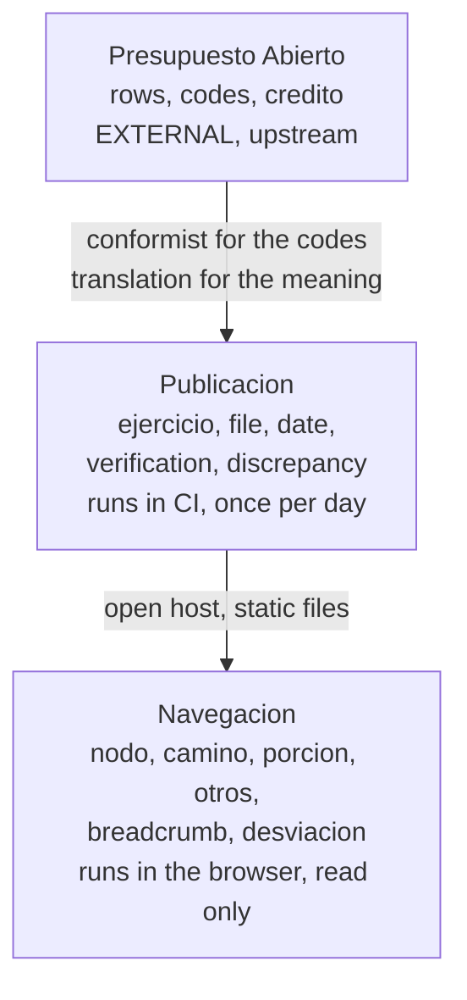
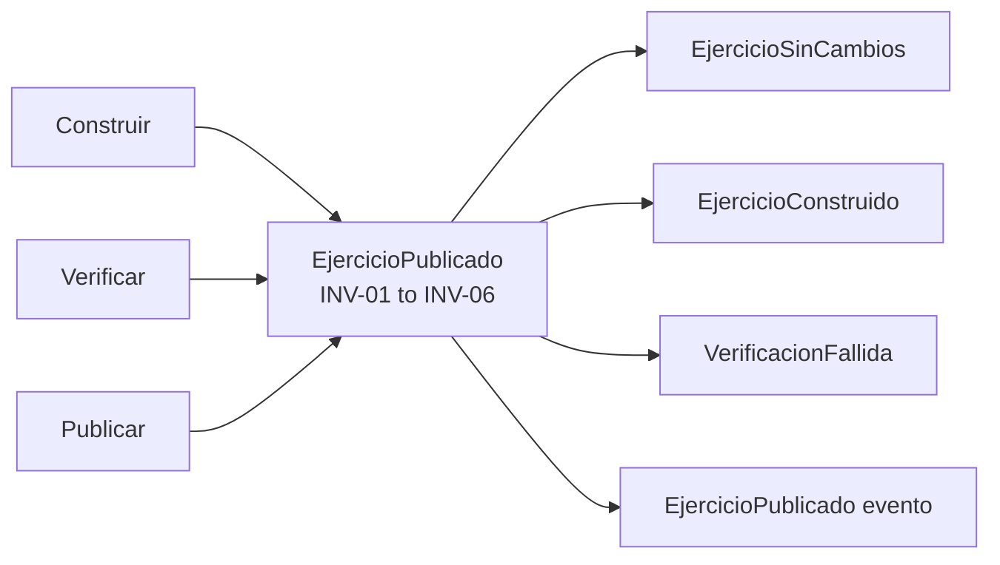
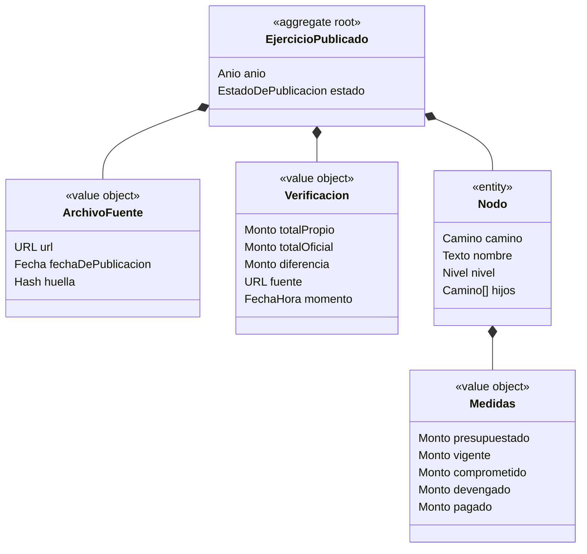
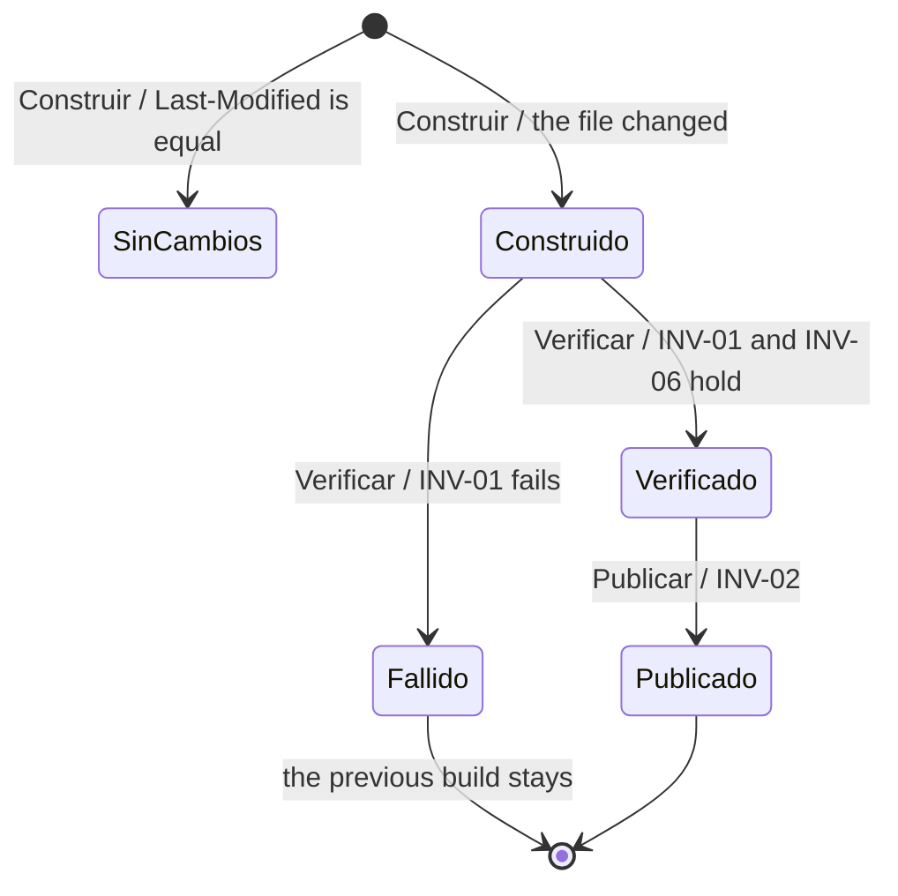
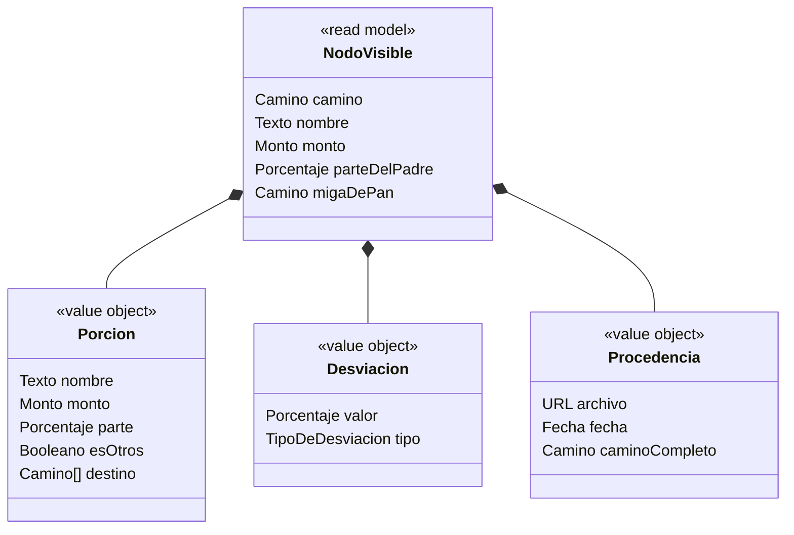

# Domain model: the public spending navigator

EventStorming: **skipped** by the user on 2026-09-15. The commands and the
events below come from section 8 of the design spec, and from the flows of the
wireframes.
Wireframes: `docs/designpowers/2026-09-14-public-spending-navigator/02-wireframes.md`
Design spec: `docs/superpowers/specs/2026-09-14-public-spending-navigator-design.md`
Glossary: `CONTEXT.md`
Status: level 1 confirmed, level 2 confirmed, level 3 confirmed

## Context

The feature touches three contexts. Presupuesto Abierto is external and
upstream. Publicacion builds the data and owns every rule of this project.
Navegacion reads what Publicacion published, and it writes nothing.

## Level 1: bounded contexts and context map

### Playback

The data starts at Presupuesto Abierto, which this project does not control.
The build downloads the files, makes the tree, verifies the total against the
official report, and publishes. The navigator reads the published files and
writes nothing. The word "otros" does not exist upstream, and that word marks
the border.

### Model

**The relationship with the upstream has two faces.** This project copies the
codes of the upstream exactly, because the provenance needs them: a code that
this project renames cannot be checked against the original file. On top of
those codes this project puts a meaning of its own, which the upstream does not
have: the tree, the slice "otros", the removal of the nodes with one child, and
the deviation.

### Numbers

| Context | New or existing | Events owned | Commands owned | Use cases served | External systems |
|---|---|---|---|---|---|
| Presupuesto Abierto | external | - | - | - | it is the external one |
| Publicacion | new | 4 | 3 | none of the visitor | 2 |
| Navegacion | new | **0** | **0** | the 8 use cases | 0 |

Navegacion with zero commands is the finding of this level. A context that only
reads has no aggregate in the usual sense. Every rule of this product lives in
the build.

| Relationship | Upstream | Downstream | Pattern | Messages per day | Sync or async |
|---|---|---|---|---|---|
| The data of the spending | Presupuesto Abierto | Publicacion | conformist plus translation | 3 HEAD, 0 to 1 downloads | async |
| The verification | The official report | Publicacion | conformist | 1 per build with a change | async |
| The published files | Publicacion | Navegacion | open host, static files | 1 deployment per change | async |

The two external systems are not the same system. The ZIP files come from
`dgsiaf-repo.mecon.gob.ar`. The report of the verification comes from an
endpoint of the official site that no public contract lists. They can fail
apart, which is why the build has a second check.

### Overloaded terms resolved

| Term | One meaning | The other meaning | Decision |
|---|---|---|---|
| `credito vigente` | At the level of the proyecto and above: the legal limit of the spending | Below the proyecto: an internal distribution, which money moves between | Measured. The limit holds at the proyecto and above with 0 exceptions in 2,673 nodes. It breaks in 12.7% of the actividades. The glossary records the two meanings. |
| deviation against the approved budget | Above the proyecto: the state spent differently from the vote of the Congress | Below the proyecto: money moved between the actividades of one proyecto | Two types in the model, and two names on the screen. See W7 and D4. |
| `credito` | In the budget: the authorization to spend | In ordinary Spanish: a loan | The product never uses the word alone. It uses the name of the measure. |

### Gate

Confirmed by the user on 2026-09-15. The user chose three contexts, and not one
context of this project. The reason: the build and the navigator run in
different places with different cadences, and they protect different rules.

## Level 2: aggregates

### Playback

`EjercicioPublicado` accepts the commands Construir, Verificar and Publicar,
and it emits four events. It guarantees INV-01 to INV-06. It holds every node
of one exercise, because the build publishes one exercise as a whole.

### Model

Navegacion has no aggregate. It has a read model, and its rules are rules of
presentation. To give it an aggregate would be to invent structure for the
method.

### Invariants

| ID | Invariant | Aggregate | Enforced on command | Source |
|---|---|---|---|---|
| INV-01 | The total devengado of a published exercise equals the official total | EjercicioPublicado | Verificar | Design spec, section 8. Measured: difference 0 in 2025 |
| INV-02 | An exercise reaches the visitor only after a verification that passed | EjercicioPublicado | Publicar | Design spec, section 8 |
| INV-03 | A published exercise names its source file and its date of publication | EjercicioPublicado | Construir | Wireframes, UC-06 |
| INV-04 | The sum of the children of a nodo equals the total of the nodo | EjercicioPublicado | Construir | Wireframes, P1 and P2 |
| INV-05 | The identity of a nodo is its full camino, and never its last code | EjercicioPublicado | Construir | Design spec, section 5. Measured: `programa_id` repeats |
| INV-06 | `devengado <= vigente` in every nodo of the proyecto level and above | EjercicioPublicado | Verificar | Measured: 0 exceptions in 2,673 nodes |
| INV-07 | The parts that one screen shows add to 100% of the parent, with "otros" | Navegacion, read model | - | Wireframes, P1 and P2 |

### Rules that the data rejects

Five rules looked correct and the data violates them. This project measured
each one against the 113,217 rows of 2025 before it wrote the model.

| Rule that looked correct | Rows that violate it |
|---|---|
| `devengado <= vigente` in every row | 51,817 (45.8%) |
| `comprometido <= vigente` in every row | 51,871 (45.8%) |
| `presupuestado <= vigente` in every row | 11,615 (10.3%) |
| `pagado <= devengado` | 5 |
| `devengado >= 0` | 1 |

**The build accepts these rows. It does not reject them.** A build that applied
the first rule would reject the file every day. The reason is in the table of
the overloaded terms: below the proyecto the `vigente` is not a limit.

The cause is measured and not supposed. Of the 303 actividades that spend more
than their own `vigente`, **the parent proyecto respects its limit in 303 of
303 cases.** One actividad spends more, a sister spends less, and the proyecto
closes inside its authorization.

### Processes

None. The build is one pipeline over one aggregate, and no policy crosses two
aggregates.

### Numbers

| Aggregate | Commands | Events | Invariants | Expected instances | Writes per day | Peak | Consistency inside | Entities inside |
|---|---|---|---|---|---|---|---|---|
| EjercicioPublicado | 3 | 4 | 6 | 3 in the first version, 32 available | 0 to 1 | 1 | strong, one exercise at a time | 128,558 nodos per exercise |
| Navegacion, read model | 0 | 0 | 1 | - | 0 | - | read only | - |

### Gate

Confirmed by the user on 2026-09-15. The user decided that the product shows
the deviation below the proyecto with the correct name, and does not hide it.

## Level 3: entities, value objects, states

### EjercicioPublicado

#### Playback

An `EjercicioPublicado` has a year, a state, one source file and one
verification. It contains the nodos of its exercise. Its state goes from
Construido to Verificado to Publicado. INV-01 is enforced on Verificar, and
INV-02 stops Publicar when the verification did not pass.

#### Class model

A `Nodo` names its children by their `Camino`, and it does not hold them as
objects.

#### State machine

#### Numbers

| Entity or value object | Attributes | Identity | Cardinality to root | Expected count | Lifetime | Personal data |
|---|---|---|---|---|---|---|
| EjercicioPublicado | 4 | Anio | root | 3 | for ever | no |
| ArchivoFuente | 3 | none | 1 | 3 | for ever | no |
| Verificacion | 5 | none | 1 | 3 | for ever | no |
| Nodo | 5 | Camino | 128,558 per exercise | 385,674 | for ever | no |
| Medidas | 5 | none | 1 per nodo | 385,674 | for ever | no |

### Navegacion, read model

`TipoDeDesviacion` has two values: `SobreLoAprobado` for a nodo of level 7 and
above, and `ReasignacionInterna` for level 8 and below. **The two are not one
number with two labels. They are two concepts that share one formula.** A type
with two values stops a screen from showing one and naming it the other.

`migaDePan` holds the full camino, and it includes the segments that the build
removed. Without them the number is not reproducible, because the visitor sees
2 names where the file needs 9 codes.

| Entity or value object | Attributes | Identity | Cardinality | Expected count | Lifetime | Personal data |
|---|---|---|---|---|---|---|
| NodoVisible | 5 | Camino | derived | - | the visit | no |
| Porcion | 5 | none | 2 to 18 per nodo, median 3 | - | the visit | no |
| Desviacion | 2 | none | 1 per nodo | - | the visit | no |
| Procedencia | 3 | none | 1 per screen | - | the visit | no |

**No model holds personal data.** The product has no user, no session and no
store of anything about the visitor.

### The domain types

| Type | What it holds | Why it is not a plain number or text |
|---|---|---|
| `Monto` | An amount in millions of pesos **of one exercise** | A peso of 2024 and a peso of 2026 are not the same unit. The type carries the exercise, so a comparison across exercises cannot be written by accident. See ADR 0001 |
| `Camino` | The ordered list of codes from the jurisdiccion to one nodo | The codes are not unique alone. The type is the identity of a nodo, and INV-05 |
| `Nivel` | 1 to 13 | The level decides the type of the deviation, and whether INV-06 applies |
| `Anio` | 1995 to the open exercise | It names an exercise |
| `Porcentaje` | A part of a whole | - |

### Invariant coverage

| Invariant | Enforced by | On command | Violated by which flow if missing |
|---|---|---|---|
| INV-01 | Verificacion | Verificar | The product would publish a number that is not the number of the state |
| INV-02 | EjercicioPublicado | Publicar | A broken build would reach the visitor |
| INV-03 | ArchivoFuente | Construir | UC-06 would have no source to show |
| INV-04 | Nodo | Construir | The parts of a pie chart would not add to the total |
| INV-05 | Nodo, through Camino | Construir | The build would add the money of two ministries together, **and no total would look wrong** |
| INV-06 | Nodo, through Nivel | Verificar | A corrupt file would pass the verification |
| INV-07 | NodoVisible | - | The pie chart would lie |

INV-05 is the invariant with the worst failure. Every other one shows itself.
That one produces wrong numbers that no sum reports.

### Gate

The user asked me to close level 3 and to review the written artifact. The user
confirmed the decision D2, because it makes the button that removes the
inflation a small change later.

## Model for the plan

| Aggregate | Module | Command handlers | Events published | Processes | Read models served |
|---|---|---|---|---|---|
| EjercicioPublicado | the build | Construir, Verificar, Publicar | 4 | none | the JSON files of one exercise |
| Navegacion | the browser | none | none | none | NodoVisible, Porcion, Desviacion, Procedencia |

The contract between the two modules is the set of published JSON files. The
navigator reads only what the build produced. A new number on a screen needs a
change in the build first.

## Decisions

| # | Decision | Alternatives rejected | Level | ADR | Date |
|---|---|---|---|---|---|
| D1 | Three contexts, two of this project | One context of this project | 1 | - | 2026-09-15 |
| D2 | `Monto` carries its exercise | A plain number | 3 | 0001 | 2026-09-15 |
| D3 | The rule of 4% belongs to Navegacion, and the threshold is a parameter | The build groups the children | 1 | - | 2026-09-15 |
| D4 | The deviation below the proyecto is shown with its correct name | Hide it. Show it with the same name | 2 | - | 2026-09-15 |
| D5 | The aggregate holds the whole exercise | One aggregate per nodo | 2 | - | 2026-09-15 |
| D6 | The build accepts the rows that violate the five rules | Reject the file | 2 | - | 2026-09-15 |

## Open questions

| # | Question | Blocks | Owner | Status |
|---|---|---|---|---|
| D-Q1 | Which price index deflates the Monto, and which exercise is the base? | The button that removes the inflation, which is out of scope today. Candidate: the IPC of INDEC. **Unverified, nobody looked for its source** | The user | open |
| D-Q2 | Does a closed exercise that changes need to tell the visitor? | Nothing. It belongs to the alerts, which are out of scope | The user | open |

No open question blocks the design spec.

## Glossary entries added to CONTEXT.md

nivel de control presupuestario, reasignacion interna, desviacion, monto,
camino, nodo, ejercicio publicado, verificacion.

## Handoff to consolidating-the-spec

- [x] Context map confirmed
- [x] Every command and event assigned to one aggregate
- [x] Invariants with IDs and owners
- [x] Entities, value objects, attributes complete for every must use case
- [x] State machines for every root with a status
- [x] Numbers tables complete, estimates marked
- [x] `CONTEXT.md` complete, no implementation detail
- [x] ADR written where the three conditions hold: ADR 0001
- [x] "Model for the plan" filled
- [x] No open question blocks the design spec
- [ ] Artifact approved by the user
