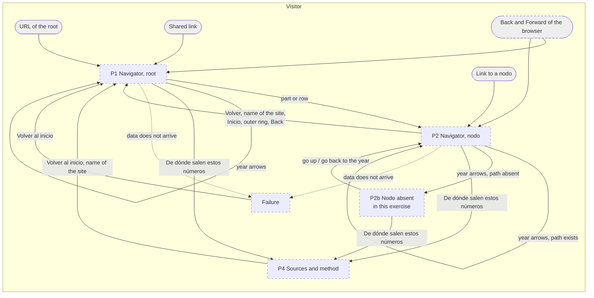
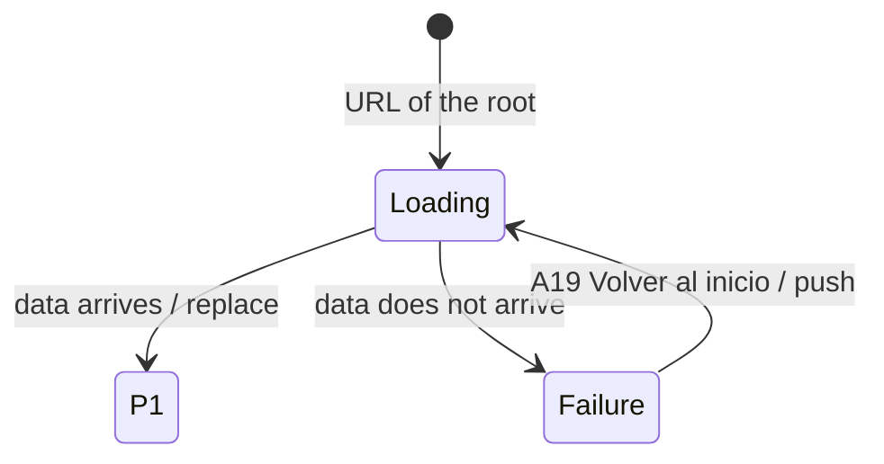
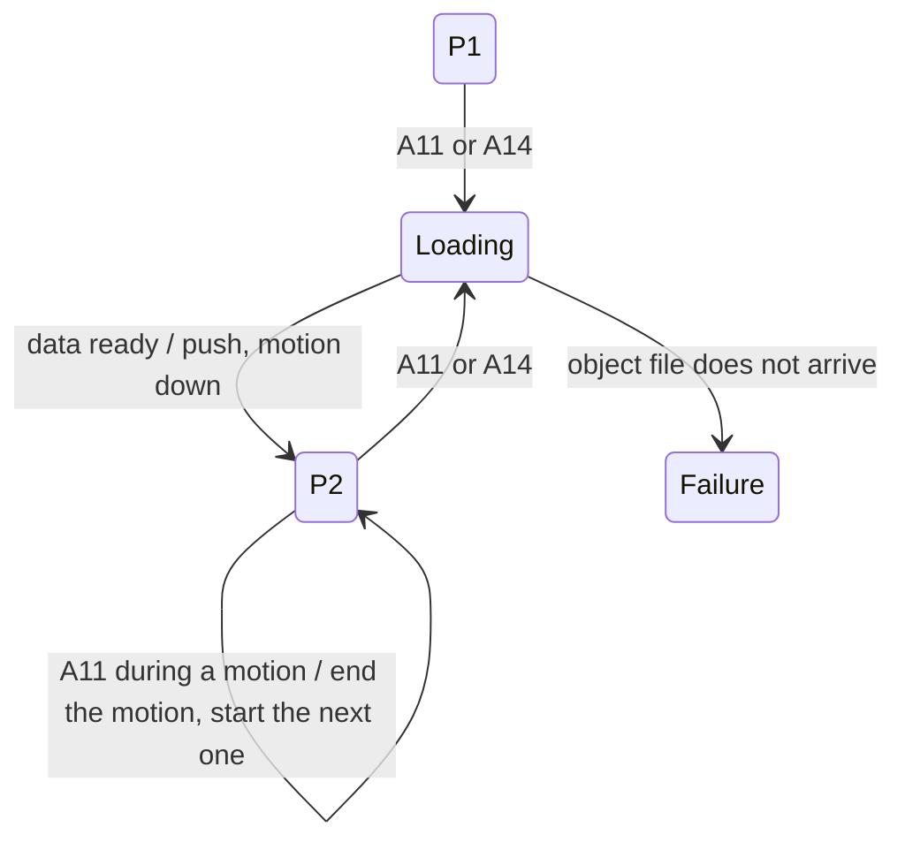
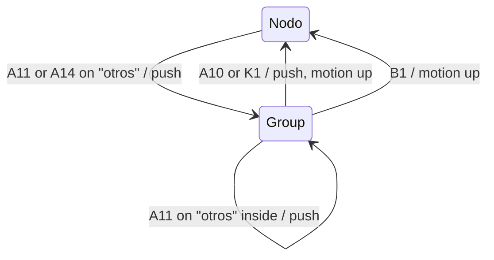
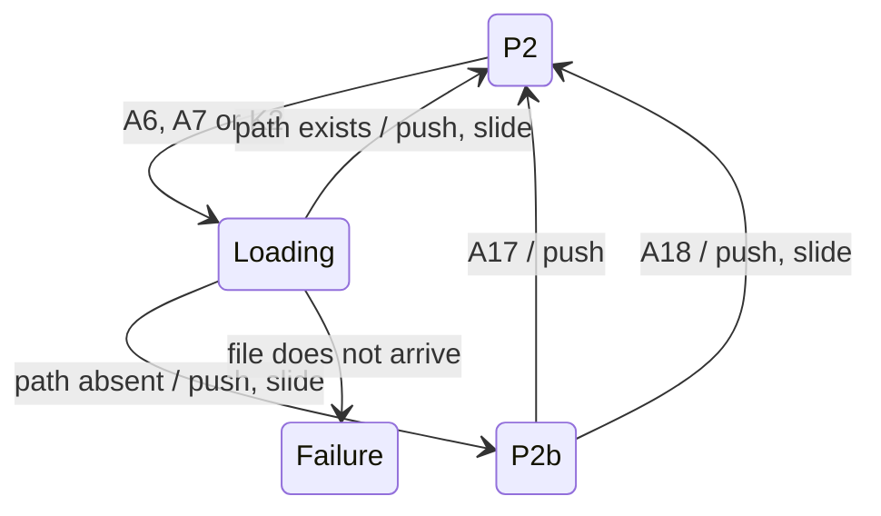
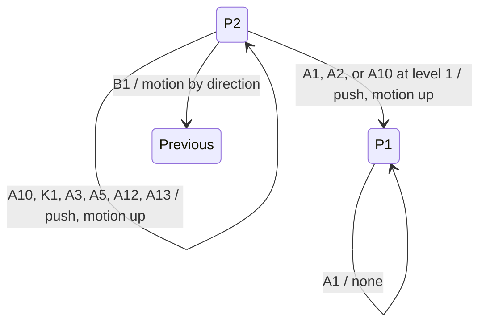
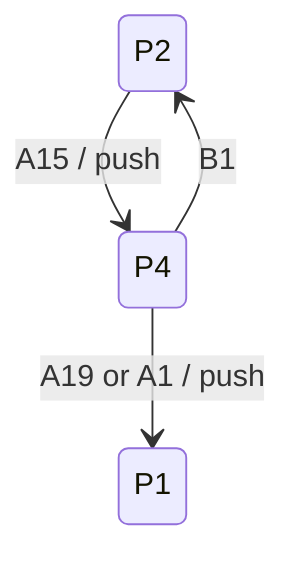
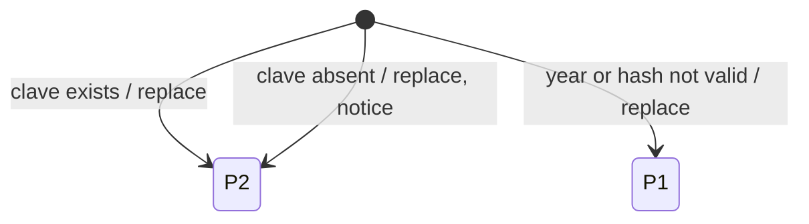
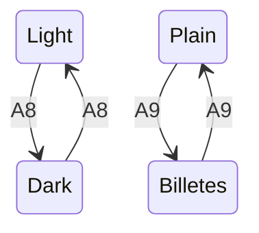

# Wireframes: the navigator redesign

EventStorming: skipped on the request of the user on 2026-09-17. The redesign adds no event.
Design spec: `docs/superpowers/specs/2026-09-17-navigator-redesign-design.md`
Base wireframes: `docs/designpowers/2026-09-14-public-spending-navigator/02-wireframes.md`
Reference prototype: `docs/designpowers/2026-09-17-navigator-redesign/prototype/index.html`
Status: level 1 confirmed, level 2 confirmed, level 3 confirmed

## Context

One actor has an interface: the visitor. This artifact covers only what the
redesign changes. The places and the use cases come from the base wireframes;
this file changes the ways between the places and adds one use case, UC-09.

## Level 0: derived inputs

Eventstorming did not run. The use cases come from the base wireframes.

| UC | Use case | Priority | In this redesign |
|---|---|---|---|
| UC-01 | See what the state spent in the last closed exercise | must | changed |
| UC-02 | Go one level down on a part | must | changed |
| UC-03 | Open the part "otros" | must | changed |
| UC-04 | Change the exercise | must | changed |
| UC-05 | Go up, and know the current position | must | changed |
| UC-06 | Know the source of a number and its date | must | changed |
| UC-07 | See the fiscal result of the exercise | should | out of scope |
| UC-08 | Share a link to the current view | should | changed |
| UC-09 | Change the look: "Oscuro" and "Billetes" | must | new |

## Level 1: screen map

### Playback

The visitor keeps the same places: P1, P2, P2b, P4 and the failure screen. P3
stays out of this redesign. No place is new; the ways between the places
change. Every place gets the same top bar: the name of the site, the
breadcrumb, the years and two switches. Three new ways move the visitor:
"Volver", the outer rings of the chart, and the Back button of the browser.
The switches change the look, and never the place.

### Model



### Numbers

| Actor | Places today | Places new | Places changed | Entry points |
|---|---|---|---|---|
| Visitor | 5 | 0 | 5 | 4: the URL of the root, a link to a nodo, a shared link, and the browser history (new) |

| Place | Serves use cases | Expected visits per day | Type |
|---|---|---|---|
| P1 Navigator, root | UC-01, 04, 08, 09 | 100 relative, estimate | screen |
| P2 Navigator, nodo | UC-02, 03, 05, 06, 08, 09 | 40 to 60 relative, estimate | screen |
| P2b Nodo absent | UC-04 | 2 to 5 relative, estimate | screen |
| P4 Sources and method | UC-06 | 2 to 5 relative, estimate | screen |
| Failure | UC-01, unhappy path | under 1 relative, estimate | screen |

| Ways to go up one level from P2 | Today | Redesign |
|---|---|---|
| Breadcrumb | yes | yes |
| Back of the browser | yes, but an open group "otros" is lost | yes, with the group "otros" too |
| "Volver" and the key Escape | no | yes |
| An outer ring of the chart | no | yes |
| The name of the site, straight to the root | no | yes |

### Gate

Confirmed by the user on 2026-09-17, with no change.

The prototype lost two parts of the product of today, and this map keeps them:

- The link "De dónde salen estos números" to P4. It is the only way to P4,
  and UC-06 is a must.
- The codes of the source at the last level (C16 of the base spec).

## Level 2: flows

### Affordances

Every flow below uses these IDs. Level 3 reuses them.

| ID | Affordance | Where |
|---|---|---|
| A1 | The name of the site, "En qué la gastan" | top bar, every place |
| A2 | Crumb "Inicio" | top bar |
| A3 | Crumb of level 1 | top bar |
| A4 | Crumb "…", which opens the hidden levels | top bar |
| A5 | Crumb of the previous level | top bar |
| A6 | Previous-year arrow | top bar |
| A7 | Next-year arrow | top bar |
| A8 | Switch "Oscuro" | top bar |
| A9 | Switch "Billetes" | top bar |
| A10 | "Volver" | chart pane, P2 |
| A11 | A part of the main ring | chart pane |
| A12 | The lit arc of the thin ring (the previous level) | chart pane |
| A13 | The lit arc of the hairline ring (level 1) | chart pane |
| A14 | The row of a part | tape pane |
| A15 | "De dónde salen estos números" | tape pane, foot |
| A16 | "Descargar el archivo oficial" | tape pane, foot |
| A17 | "Subir al nivel que sí existe" | P2b |
| A18 | "Volver a <año>" | P2b |
| A19 | "Volver al inicio" | P4 and the failure screen |
| A20 | The link to the file of one exercise | P4 |
| A21 | "El código de este proyecto" | P4 |
| K1 | The key Escape | keyboard |
| K2 | The keys ArrowLeft and ArrowRight | keyboard |
| B1 | Back of the browser | browser |
| B2 | Forward of the browser | browser |

The navigator only reads data, so no affordance fires a domain event. The
state that changes is the history of the browser: "push" adds an entry,
"replace" changes the current entry, "none" leaves the history as it is.

### UC-01 See the last closed exercise

#### Playback

The visitor opens the URL of the root. The top bar draws at once, and the
chart pane says "Cargando el gasto público…". When the data arrives, the main
ring grows once from nothing to its parts, and the rows of the tape print in.
This is the only motion that no tap starts. If the data does not arrive, the
visitor lands on the failure screen.

#### Breadcrumb

```
ENTRY: URL of the root
  -> load manifest and the file of the last closed exercise -> replace -> PLACE: P1
  -> data does not arrive -> PLACE: Failure
```



#### Unhappy paths

| Path | Covered | Lands on |
|---|---|---|
| Validation error | not applicable: the visitor types nothing | - |
| Empty state | not possible: the build publishes no exercise with no spending | - |
| No permission | not applicable: no login | - |
| Timeout or external failure | yes | Failure |

### UC-02 Go one level down

#### Playback

The visitor at P1 or P2 taps a part of the main ring (A11) or its row (A14).
When the children of that part live in the object file, the file loads first;
after 300ms the disc says "Cargando…". Then the tapped arc widens into the main
ring, and its children start inside its angle. The navigator skips every nodo
with one child, and the history keeps only the nodo where the visitor lands.

#### Breadboard

```
PLACE: P1 or P2
  A11 part of the main ring  -> load the object file if needed -> push -> PLACE: P2 (child)
  A14 row of a part          -> same as A11
```



#### Unhappy paths

| Path | Covered | Lands on |
|---|---|---|
| Validation error | not applicable | - |
| Empty state | yes: a nodo with no spending shows an empty ring outline and "Este nivel no gastó nada en <año>" | P2 |
| No permission | not applicable | - |
| Timeout or external failure | yes | Failure |
| A tap during a motion | yes: the motion ends at once | P2 |
| The last level | yes: one full ring, one row, the codes of the source; A11 does nothing | P2 |

### UC-03 Open the part "otros"

#### Playback

The visitor taps the part "otros" (A11 or A14). The history gets an entry with
the same hash and the claves of the group in its state. The chart shows the
parts of the group, the title says "Otros", and the line under it says the
part of the total. "Volver" (A10) leaves the group. A group can hold another
"otros".

#### Breadboard

```
PLACE: P1 or P2
  A11 or A14 on "otros"  -> push (same hash, state = the group) -> PLACE: P1 or P2, group view
PLACE: group view
  A10 Volver             -> push -> PLACE: the nodo without the group
```



#### Unhappy paths

| Path | Covered | Lands on |
|---|---|---|
| Validation error | not applicable | - |
| Empty state | yes: a group with no spending says "Estas partidas no gastaron nada en <año>" | group view |
| No permission | not applicable | - |
| Timeout or external failure | not applicable: the group uses data already loaded | - |
| B1 to an entry whose group the data no longer has | yes: draw the nodo without the group | P2, replace |

### UC-04 Change the exercise

#### Playback

The visitor presses the previous-year arrow (A6), the next-year arrow (A7) or
a key (K2). The file of that year loads, and the screen slides: an older year
from the left, a newer year from the right. The path stays. When the path does
not exist in that year, the visitor lands on P2b. An open group "otros" closes,
and the visitor stays on its nodo. The arrow at an end is disabled.

#### Breadboard

```
PLACE: P1, P2 or group view
  A6 or K2 ArrowLeft   -> load the year before -> push -> PLACE: same path, or P2b
  A7 or K2 ArrowRight  -> load the year after  -> push -> PLACE: same path, or P2b
PLACE: P2b
  A17 Subir al nivel que sí existe -> push -> PLACE: P2 (nearest ancestor)
  A18 Volver a <año>               -> push -> PLACE: P2 (the path, in the year of origin)
```



#### Unhappy paths

| Path | Covered | Lands on |
|---|---|---|
| Validation error | not applicable | - |
| Empty state | yes: P2b | P2b |
| No permission | not applicable | - |
| Timeout or external failure | yes | Failure |
| Two presses before the file arrives | yes: the last press wins | the last year |
| An arrow at an end | yes: disabled, and K2 does nothing | same place |

### UC-05 Go up, and know the current position

#### Playback

The visitor knows the position from three things: the title names the nodo,
the breadcrumb names level 1 and the previous level, and the outer rings light
the path. To go up, the visitor uses "Volver" (A10) or Escape (K1) for one
level, a crumb (A2, A3, A5) or a lit arc (A12, A13) for that level, or the name
of the site (A1) for the root. Every step up pushes an entry and plays the
motion up. Back (B1) replays the history as the visitor lived it.

#### Breadboard

```
PLACE: P2 or group view
  A10 Volver or K1 Escape     -> push -> PLACE: parent, or the nodo without the group
  A2 Inicio or A1 name        -> push -> PLACE: P1
  A3 crumb of level 1         -> push -> PLACE: P2 (level 1)
  A4 "…"                      -> none -> the breadcrumb shows every level
  A5 crumb of previous level  -> push -> PLACE: P2 (previous)
  A12 lit arc, thin ring      -> push -> PLACE: P2 (previous)
  A13 lit arc, hairline ring  -> push -> PLACE: P2 (level 1)
  B1 Back / B2 Forward        -> none -> PLACE: the entry before / after
```



#### Unhappy paths

| Path | Covered | Lands on |
|---|---|---|
| Validation error | not applicable | - |
| Empty state | not applicable | - |
| No permission | not applicable | - |
| Timeout or external failure | not applicable: the ancestors use data already loaded | - |
| B1 after a shared link, with no entry before | yes: the browser leaves the site, as any site does; A10 still goes up | outside |
| A tap on a dim arc of an outer ring | yes: nothing happens; only a lit arc goes back | same place |

### UC-06 Know the source of a number

#### Playback

The foot of the tape is always visible. It names the source, the measure, the
date of the file, and offers "Descargar el archivo oficial" (A16). At the last
level it adds the codes of the rows. "De dónde salen estos números" (A15) opens
P4, which lists the file of every exercise and its check.

#### Breadboard

```
PLACE: P1, P2 or P2b
  A15 De dónde salen estos números -> push -> PLACE: P4
  A16 Descargar el archivo oficial -> none -> the official ZIP downloads
PLACE: P4
  A20 file of one exercise         -> none -> the official ZIP downloads
  A19 Volver al inicio or A1       -> push -> PLACE: P1
```



#### Unhappy paths

| Path | Covered | Lands on |
|---|---|---|
| Validation error | not applicable | - |
| Empty state | yes: a manifest with no date shows the raw header, as today | same place |
| No permission | not applicable | - |
| Timeout or external failure | yes: the manifest does not arrive | Failure |

### UC-08 Share a link to the current view

#### Playback

The URL bar always holds the year and the path. The visitor copies it with the
browser. The receiver lands on that year and that nodo. An open group "otros"
is not in the URL, so the receiver lands on its nodo.

#### Breadboard

```
ENTRY: shared link #/<year>/<clave>
  -> clave exists        -> replace -> PLACE: P2
  -> clave absent        -> replace -> PLACE: P2 (nearest ancestor) + one-line notice
  -> year not published  -> replace -> PLACE: P1 (entry year)
```



#### Unhappy paths

| Path | Covered | Lands on |
|---|---|---|
| Validation error | yes: a hash that is not valid | P1 |
| Empty state | yes: a clave absent in that year | P2, nearest ancestor |
| No permission | not applicable | - |
| Timeout or external failure | yes | Failure |

### UC-09 Change the look

#### Playback

The visitor flips "Oscuro" (A8) or "Billetes" (A9). The screen stays where it
is; only the look changes, with a crossfade of 200ms. "Billetes" adds one
sentence under the title. The browser remembers the choice. A switch is not a
step, so it adds no history entry, and Back does not undo it.

#### Breadboard

```
PLACE: any
  A8 Oscuro    -> none -> same place, dark look, choice stored
  A9 Billetes  -> none -> same place, bill colours, typeface, sentence, choice stored
```



#### Unhappy paths

| Path | Covered | Lands on |
|---|---|---|
| Validation error | not applicable | - |
| Empty state | not applicable | - |
| No permission | yes: storage refused; the look works for this visit only | same place |
| Timeout or external failure | yes: a font file does not load; a system font replaces it | same place |
| Reduced motion | yes: the look changes with no crossfade | same place |

### Numbers

| UC | Steps on the happy path | Inputs typed | Places touched | Unhappy paths covered | Target time to complete | Target completion rate | Drop-off risk at |
|---|---|---|---|---|---|---|---|
| UC-01 | 0 | 0 | P1 | 1 of 1 that apply | chart visible under 2 s on a 4G telephone, estimate | 95%, estimate | the wait for the first file |
| UC-02 | 1 | 0 | P1 or P2, then P2 | 5 | under 1 s with the motion, estimate | 90%, estimate | a part too thin to tap; the row of the tape covers it |
| UC-03 | 1 | 0 | P2 | 2 | under 1 s, estimate | 90%, estimate | "otros" says nothing of its content; the row shows the count |
| UC-04 | 1 | 0 | P1, P2, P2b | 4 | under 1.5 s with a new file, estimate | 85%, estimate | P2b |
| UC-05 | 1 | 0 | P1, P2 | 2 | under 1 s, estimate | 95%, estimate | a deep shared link with no history; "Volver" covers it |
| UC-06 | 0 to see, 1 to P4 | 0 | P1, P2, P2b, P4 | 2 | 0 s to see, estimate | 90%, estimate | on a telephone the foot sits below the list |
| UC-08 | 1, in the browser | 0 | P2 | 3 | not measured | 90%, estimate | the group "otros" is not in the link |
| UC-09 | 1 | 0 | any | 3 | under 0.3 s, estimate | 95%, estimate | the word "Billetes" does not say what it does |

### Gate

Confirmed by the user on 2026-09-17, with the decisions W4 to W10.

RQ2 of the spec (a swipe to change the year on a telephone) is closed with no
swipe. The agent recommended it at this gate, and the user confirmed the level
with no request for a swipe. See W11.

## Level 3: sketches

On a desktop every place has two panes side by side: the chart pane at the
left and the tape pane at the right. Each pane gets its own box here, because
one box of 40 columns cannot hold both. On a telephone the chart pane comes
first. The top bar is the same on every place, so it has one sketch.

### The top bar (changed, on every place)

```
+--------------------------------------+
| En qué la gastan                  A1 |
| Inicio > Capital Humano > ... > Prev |
|  A2      A3               A4    A5   |
|            A6 <  2025  > A7          |
|    (o) Oscuro A8   (o) Billetes A9   |
+--------------------------------------+
```

Data shown: the name of the site; the breadcrumb built from the path (the
names of level 1 and of the previous level); the year on screen.
Inputs collected: none.
Rules enforced: the breadcrumb never names the current nodo; two names that
differ only in accents or case are one crumb; "…" holds every level between
level 1 and the previous level; the arrow at 2024 or at 2026 is disabled.
Variants: at the root, no breadcrumb; at level 1, only "Inicio"; "…" open; on
a desktop one row; at 375px three rows (name and breadcrumb, years, switches).

### P1 Navigator, root (changed)

Chart pane:

```
+--------------------------------------+
| En qué la gastó el Estado nacional   |
| Crédito devengado del ejercicio      |
| 2025, por jurisdicción               |
| [Billetes on] De cada $100 que gastó |
| el Estado nacional en 2025, $60      |
| fueron a Ministerio de Capital Humano|
| 96,1% de lo autorizado · +31% sobre  |
| lo aprobado                          |
|            .-~~~~~~~~-.              |
|         .'   parts A11  '.           |
|        |       123,5      |          |
|        |      billones    |          |
|         '.              .'           |
|            '-........-'              |
+--------------------------------------+
```

Tape pane:

```
+--------------------------------------+
| # Ministerio de Capital Humano 59,8% |
|                      73,8 billones   |
| # Servicio de la Deuda Pública  8,4% |
|                      10,4 billones   |
| ...                          A14     |
| # Otros (8)                     5,6% |
|======================================|
| Total devengado 2025                 |
|         123.533.955.013.702 pesos    |
| Fuente: Presupuesto Abierto, Minis-  |
| terio de Economía. Crédito devengado,|
| publicado el 8 jul 2026.             |
| Descargar el archivo oficial    A16  |
| De dónde salen estos números    A15  |
+--------------------------------------+
```

Data shown: from the manifest, the year, the date of publication, the URL of
the file and the verified total; from the institutional file, the sum of `d`,
`v` and `p` over the jurisdicciones, and the name and `d` of every
jurisdiccion.
Inputs collected: none.
Rules enforced: parts under 4% join "otros"; "otros" takes the neutral colour;
the text of the disc stays inside the disc; the measure is named here and in
the foot only; the foot is always visible; no page scroll at 1440x900 or
1280x720.
Variants: loading ("Cargando el gasto público…" in the chart pane); failure
(the failure screen); "Billetes" on (the sentence); "Oscuro" on.
Primary action: open a part (A11, or its row A14).

### P2 Navigator, nodo (changed)

Chart pane:

```
+--------------------------------------+
| <- Volver A10                        |
| Secretaría de Educación              |
| [Billetes on] De cada $100 que gastó |
| Secretaría de Educación en 2025, $78 |
| fueron a Desarrollo de la Educación  |
| Superior.                            |
| <n>% del gasto total · <n>% de lo    |
| autorizado · <+n>% sobre lo aprobado |
|      .- hairline ring, lit A13 -.    |
|    .'  .- thin ring, lit A12 -.  '.  |
|   |   |   .- main ring A11 -.  |   | |
|   |   |  |       5,7        | |   | |
|   |   |  |     billones     | |   | |
|    '.  '-.                .-'  .'    |
+--------------------------------------+
```

Tape pane:

```
+--------------------------------------+
| # Desarrollo de la Educación   77,7% |
|   Superior           4,5 billones    |
| # Plan Nacional de Alfabeti-    7,1% |
|   zación        407.665,4 millones   |
| ...                          A14     |
| # Otros (11)                    5,1% |
|======================================|
| Suma de estas partidas               |
|           5.732.849.404.275 pesos    |
| Fuente: ... publicado el 8 jul 2026. |
| [last level] programa_id=26 ...      |
| Descargar el archivo oficial    A16  |
| De dónde salen estos números    A15  |
+--------------------------------------+
```

Data shown: the name, `d`, `v` and `p` of the nodo; the name and `d` of every
child; the names on the path; the arcs of the previous level and of level 1;
at the last level, the codes of the rows.
Inputs collected: none.
Rules enforced: the navigator skips a nodo with one child; the deviation says
"sobre lo aprobado" at the level of the proyecto and above, and "de
reasignación dentro del proyecto" below it; only a lit arc of an outer ring
navigates; every arc that navigates has a hit area of 24px or more; "Volver"
has a hit area of 44x44px or more.
Variants:
- A group "otros": the title "Otros", the line shows only the part of the
  total, "Volver" leaves the group.
- The last level: one full ring, one row, the codes in the foot; A11 does
  nothing.
- No spending: an empty ring outline and "Este nivel no gastó nada en <año>".
- Loading: after 300ms the disc says "Cargando…".
- A shared link to an absent clave: the nearest ancestor, with the line "Ese
  nivel no existe en <año>; te llevamos al más cercano."
Primary action: open a part (A11, or its row A14). At the last level: "Volver"
(A10).

### P2b Nodo absent in this exercise (changed)

Chart pane:

```
+--------------------------------------+
| Desarrollo de la Educación Superior  |
|                                      |
| Este nivel no existe en 2026.        |
| En 2025 gastó 4,5 billones.          |
|                                      |
| +----------------------------------+ |
| | Subir al nivel que sí existe A17 | |
| +----------------------------------+ |
|   Volver a 2025                A18   |
|                                      |
|        ( an empty ring outline )     |
+--------------------------------------+
```

Tape pane: no rows; the foot of the year on screen, with A15 and A16.

Data shown: the name of the absent nodo, the year on screen, the year of
origin and the value of the nodo in that year.
Inputs collected: none.
Rules enforced: the year arrows change the year and nothing else (C17). P2b
shows no "Volver", because its two exits already go up and back.
Variants: none.
Primary action: "Subir al nivel que sí existe" (A17).

### P4 Sources and method (changed)

Chart pane:

```
+--------------------------------------+
| De dónde salen estos números         |
|                                      |
| (the copy of today: the source, the  |
| licence CC BY 4.0, and how the build |
| checks the total against the report  |
| "Cuenta Ahorro Inversión             |
| Financiamiento")                     |
|                                      |
| +----------------------------------+ |
| | Volver al inicio             A19 | |
| +----------------------------------+ |
|   El código de este proyecto   A21   |
+--------------------------------------+
```

Tape pane:

```
+--------------------------------------+
| Año   Archivo              Publicado |
| 2024  credito-anual-2024  4 jul 2025 |
|       verificado            A20      |
| 2025  credito-anual-2025  8 jul 2026 |
|       verificado            A20      |
| 2026  credito-anual-2026 13 sep 2026 |
|       verificado            A20      |
+--------------------------------------+
```

Data shown: from the manifest, for every exercise, the file, its date of
publication and whether the build verified it.
Inputs collected: none.
Rules enforced: none new.
Variants: failure (the manifest does not arrive).
Primary action: "Volver al inicio" (A19).

### Failure (changed)

Chart pane:

```
+--------------------------------------+
| (the message of today)               |
| (the technical detail, small)        |
|                                      |
| +----------------------------------+ |
| | Volver al inicio             A19 | |
| +----------------------------------+ |
|   De dónde salen estos números A15   |
+--------------------------------------+
```

Tape pane: empty.

Data shown: the message and the technical detail of the error.
Inputs collected: none.
Rules enforced: none new.
Variants: none.
Primary action: "Volver al inicio" (A19).

### Numbers

| Place | Fields shown | Inputs | Primary action | Secondary actions | Rules enforced | Variants |
|---|---|---|---|---|---|---|
| Top bar | 3 | 0 | none | A1 to A9 | 4 | 5 |
| P1 | 11 | 0 | open a part (A11, A14) | A1 to A9, A15, A16 | 6 | 4 |
| P2 | 14 | 0 | open a part (A11, A14); "Volver" at the last level | A10, A12, A13, A1 to A9, A15, A16 | 5 | 5 |
| P2b | 4 | 0 | A17 | A18, A15, A16, A1 to A9 | 2 | 0 |
| P4 | 4 per exercise | 0 | A19 | A20, A21, A1 to A9 | 0 | 1 |
| Failure | 2 | 0 | A19 | A15, A1 | 0 | 0 |

### Gate

Confirmed by the user on 2026-09-17, with the decisions W12 and W13. The user
accepted the recommendation of the agent on RQ1 and RQ4 (W14, W15).

## Data, inputs and rules for domain modeling

Domain modeling is skipped: the redesign reads the same files and changes no
invariant. The table lists what the plan needs to read.

| Place | Data shown (read model, fields) | Inputs (command attributes) | Rules (invariant candidates) |
|---|---|---|---|
| Top bar | the path (names), the year, the list of years | none | names compared without accents and case; the arrows stop at the ends |
| P1 | manifest (year, date, URL, total, verified); institutional file (`n`, `d`, `v`, `p`, `k` of the jurisdicciones) | none | rule of 4%; the text of the disc fits the disc |
| P2 | institutional file and object file (`n`, `d`, `v`, `p`, `k`) for the nodo, its children, its ancestors | none | skip a nodo with one child; the word of the deviation by level (NIVEL_DE_CONTROL = 7) |
| P2b | the institutional file of two years | none | the arrows change the year and nothing else |
| P4 | manifest (every exercise) | none | none |
| Failure | the error | none | none |

## Decisions

| # | Decision | Alternatives rejected | Level | Date |
|---|---|---|---|---|
| W1 | No new place. The five places change. | A place for the settings of the look | 1 | 2026-09-17 |
| W2 | One top bar on every place: the name of the site, the breadcrumb, the years, "Oscuro", "Billetes" | A top bar only on P1 and P2 | 1 | 2026-09-17 |
| W3 | The link to P4 and the codes of the source at the last level stay, although the prototype lost them | Follow the prototype | 1 | 2026-09-17 |
| W4 | On the first load the main ring grows once. No other motion starts without a tap. | No motion on load. Motion on every panel | 2 | 2026-09-17 |
| W5 | A change of year closes an open group "otros" and keeps its nodo | Keep the group. Go to the root | 2 | 2026-09-17 |
| W6 | Every step pushes one entry, "Volver" too. Back replays the history as the visitor lived it | "Volver" calls Back when the entry before is the parent | 2 | 2026-09-17 |
| W7 | Only a lit arc of an outer ring navigates. A dim arc does nothing | A dim arc jumps to that sibling | 2 | 2026-09-17 |
| W8 | A group "otros" is not in the URL; a shared link opens its nodo | Put the claves of the group in the URL | 2 | 2026-09-17 |
| W9 | A switch of the look adds no history entry | A switch is a step that Back undoes | 2 | 2026-09-17 |
| W10 | When the children live in the object file, the data loads before the motion; after 300ms the disc says "Cargando…" | Start the motion and fill it later | 2 | 2026-09-17 |
| W11 | No swipe changes the year on a telephone. The arrows and the keys do it | A horizontal swipe on the chart: nobody sees it, and it can collide with the scroll | 2 | 2026-09-17 |
| W12 | P2b shows no "Volver". Its two exits already go up and back | "Volver" beside the two exits | 3 | 2026-09-17 |
| W13 | P4 puts the method in the chart pane and the table of files in the tape pane | The whole P4 in one column | 3 | 2026-09-17 |
| W14 | The parts do not take a hue from their parent. The colours restart at every level, by size. The lit arc of the thin ring keeps the colour of the parent, so the path stays visible | Tones of the colour of the parent: adjacent parts look the same again (closes RQ1) | 3 | 2026-09-17 |
| W15 | The sentence of "Billetes" keeps "$<n> los gastó <nodo> en forma directa" when the largest part has the name of the nodo | "fueron al propio <nodo>": the article must agree with every name, as in "a la propia Secretaría" (closes RQ4) | 3 | 2026-09-17 |

## Open questions

| # | Question | Blocks | Owner | Status |
|---|---|---|---|---|
| RQ1 | Do the parts take a hue from the colour of their parent? | nothing | the user | closed by W14 |
| RQ2 | Does a telephone change the year with a swipe? | nothing | the user | closed by W11 |
| RQ4 | Does "$<n> los gastó <nodo> en forma directa" read well? | nothing | the user | closed by W15 |

## Glossary entries added to CONTEXT.md

None. The new words on the screens ("Volver", "Oscuro", "Billetes") name
controls of the interface, not terms of the budget.

## Handoff to consolidating-the-spec

Domain modeling is skipped on the request of the user, so this artifact hands
off to `designpowers:consolidating-the-spec`.

- [x] Screen map confirmed, new and existing places marked
- [x] One flow per must use case, unhappy paths covered
- [x] One sketch per new or changed place
- [x] Numbers tables complete, estimates marked
- [x] "Data, inputs and rules for domain modeling" filled
- [x] CONTEXT.md updated (no new term)
- [x] No open question blocks the next stage
- [x] Artifact approved by the user
