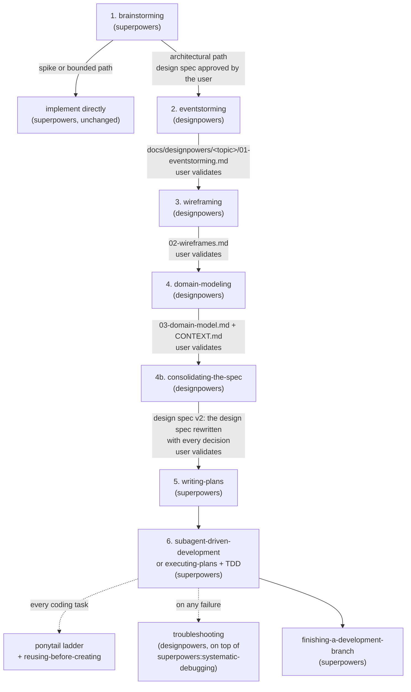
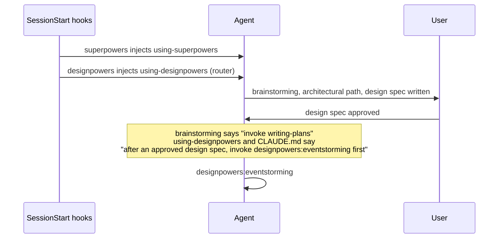

# Designpowers: structure proposal

Status: implemented in phases 0 to 7 (2026-09-08 to 2026-09-11). See `docs/WORKFLOW.md` for the map.

Designpowers is a Claude Code plugin repository and a GitHub template. It extends
Superpowers (obra/superpowers) with three design stages between `brainstorming` and
`writing-plans`. It also ships the lead-orchestrator profile and its agent roster, a
reuse-first rule for the implementation stage, and a troubleshooting skill.

This document proposes the structure. Nothing is implemented yet.

## 1. Research summary

The proposal rests on these verified facts.

| Topic | Finding | Consequence |
|---|---|---|
| Superpowers (v6.3.0, MIT) | 14 skills in a flat `skills/<name>/SKILL.md` namespace. Hand-offs are plain text: `**REQUIRED SUB-SKILL:** Use superpowers:<name>`. A `SessionStart` hook injects `using-superpowers` into every session. | We copy the same SKILL.md format and the same hand-off wording. |
| Superpowers `brainstorming` | Three paths: spike, bounded, architectural. Only the architectural path writes a design spec (`docs/superpowers/specs/YYYY-MM-DD-<topic>-design.md`) and then says: "Invoke the writing-plans skill. Do NOT invoke any other skill." | The new stages run only on the architectural path. We must redirect this one hand-off. |
| Superpowers `using-superpowers` | "User instructions (CLAUDE.md, AGENTS.md ...) take precedence over skills." | CLAUDE.md plus a hook-injected router is the sanctioned way to redirect a hand-off without a fork. |
| Superpowers policy | README: "we don't generally accept contributions of new skills." Domain skills belong in a standalone plugin. | Designpowers is a companion plugin, not a fork and not a PR. |
| Superpowers on this machine | Skill folders exist in `~/.agents/skills/` but the plugin is not installed. The bootstrap hook never runs, so the skills are inert. | The template installs Superpowers as a real plugin from `claude-plugins-official`. |
| web3pago profile | `.claude/plugins/ranu/` holds 6 agents and the `lead-orchestrator` output style (`force-for-plugin: true`). `enable-profile.mjs` maps `git user.email` to a profile. Community skills are vendored with `skills-lock.json` into `.agents/skills/` and symlinked into `.claude/skills/`. | All of this is generic and portable. Only `dev-workflow`, `privy`, `CONTEXT.md` and the email map are project specific. |
| Ponytail (DietrichGebert/ponytail, MIT, v4.9.0) | A plugin, not a passive skill. Hooks on `SessionStart`, `SubagentStart` and `UserPromptSubmit` force a 7-rung YAGNI ladder: exists? in codebase? stdlib? native? installed dependency? one line? minimum implementation. Coding tasks only. | Rungs 2 and 5 cover "search the codebase and the dependencies first". It does not cover services, MCP tools or skills. We add that gap. |
| "Search before create" skills | No community skill enforces a discovery gate. Superpowers and Matt Pocock skills only advise "follow existing patterns" at design time. | We write `reusing-before-creating` ourselves. |
| Troubleshooting skills | Superpowers `systematic-debugging` (Iron Law: no fix without root cause; 4 phases; `root-cause-tracing.md`; `find-polluter.sh`). Matt Pocock `diagnosing-bugs` (build the feedback loop first; 6 phases; `hitl-loop.template.sh`). Both are methods. Neither lists the tools of a concrete stack. | We keep `systematic-debugging` as the method and add a tool map on top. |
| Community modeling skills | EventStorming: only DGouron's skill (French, tied to one project). Wireframing: bendrucker (SVG/HTML), no ASCII or breadboarding skill exists. Domain modeling: Matt Pocock `domain-modeling` (glossary discipline, no diagrams). Mermaid: WH-2099/mermaid-skill (23 types, weekly sync from upstream docs, includes C4). C4: cheriftj/c4-model-skill (Simon Brown rules, drill-down gate). | We write the three stage skills ourselves. We vendor the Mermaid and C4 reference files and borrow structure from the others. |

Full research notes are in the session scratchpad. Source URLs are in section 9.

## 2. The target flow



Rules that apply to every new stage:

- Input and output are explicit files. The output of one stage is the input of the next.
- Deliverables are text: Markdown with Mermaid, and ASCII only for single-screen sketches.
- Drill down: start at the macro level. Go one level down only after the user agrees on the
  current level.
- Stop for human validation before the hand-off. The goal is shared understanding, not speed.
- What is agreed at a gate is written into the artifact before the next level starts, in a
  "Decisions" section and an "Open questions" section. The conversation is not the record.
- The stages run only on the architectural path of `brainstorming`, or when the user asks for
  one of them by name.

### 2.1 How the hand-off is redirected without a fork



Three layers say the same thing, so the redirect survives a compacted context:

1. `using-designpowers` (injected by our `SessionStart` hook, same pattern as Superpowers).
2. A short rule in the template `CLAUDE.md`. Superpowers states that CLAUDE.md wins over skills.
3. The `eventstorming` skill description triggers on "approved design spec".

We validate the redirect with pressure-scenario tests, the method that `superpowers:writing-skills`
prescribes. If the redirect fails in tests, the fallback is a `designpowers:brainstorming` wrapper.
We do not plan for that fallback now.

## 3. Repository layout

```
Designpowers/
├── .claude-plugin/
│   └── marketplace.json            # marketplace "designpowers": plugins designpowers, ranu
├── plugins/
│   ├── designpowers/               # the methodology plugin
│   │   ├── .claude-plugin/plugin.json
│   │   ├── hooks/
│   │   │   ├── hooks.json          # SessionStart -> inject using-designpowers
│   │   │   │                       # SubagentStart -> inject reusing-before-creating gate
│   │   │   └── session-start.mjs
│   │   └── skills/
│   │       ├── using-designpowers/SKILL.md
│   │       ├── eventstorming/
│   │       │   ├── SKILL.md
│   │       │   └── references/{legend.md, templates.md, mermaid-flowchart.md}
│   │       ├── wireframing/
│   │       │   ├── SKILL.md
│   │       │   └── references/{breadboarding.md, ascii-kit.md, mermaid-state-flow.md}
│   │       ├── domain-modeling/
│   │       │   ├── SKILL.md
│   │       │   └── references/{context-format.md, adr-format.md, mermaid-c4.md, mermaid-class-er.md, c4-review-checklist.md}
│   │       ├── consolidating-the-spec/
│   │       │   ├── SKILL.md
│   │       │   └── references/design-spec-v2-template.md
│   │       ├── reusing-before-creating/SKILL.md
│   │       └── troubleshooting/
│   │           ├── SKILL.md
│   │           └── references/{tool-map.md, feedback-loop.md}
│   └── ranu/                       # the orchestrator profile, ported from web3pago
│       ├── .claude-plugin/plugin.json
│       ├── agents/{architect,deep-reviewer,explore,implementer,locator,researcher,troubleshooter}.md
│       └── output-styles/lead-orchestrator.md
├── .claude/
│   ├── settings.json               # marketplaces, enabledPlugins, hooks, base permissions
│   ├── hooks/enable-profile.mjs    # ported as is
│   └── profiles.json               # template: "<your-git-email>": "ranu@designpowers"
├── .agents/skills/                 # vendored community skills (npx skills add), symlinked into .claude/skills/
├── skills-lock.json
├── docs/
│   ├── WORKFLOW.md                 # the six stages, with Mermaid
│   ├── WRITING_STYLE.md            # ported as is
│   ├── proposals/                  # this file
│   ├── superpowers/{specs,plans}/  # written by Superpowers
│   └── designpowers/<YYYY-MM-DD-topic>/  # written by the three stages
├── tests/
│   └── scenarios/*.md              # pressure scenarios for each skill (writing-skills method)
├── scripts/setup.sh                # one-shot: marketplaces, plugins, skills, profile
├── CLAUDE.md                       # template with the redirect rule and the hard rules
├── CONTEXT.md                      # empty glossary template (Matt Pocock CONTEXT-FORMAT)
├── README.md                       # "Use this template" and "add to an existing repo"
└── LICENSE                         # MIT
```

Two ways to consume the repo:

| Mode | For | Mechanism |
|---|---|---|
| Template | A new project | GitHub "Use this template". The plugins live in the repo. `.claude/settings.json` registers the local marketplace with a relative path, as web3pago does today. |
| Marketplace | An existing project such as web3pago | `extraKnownMarketplaces.designpowers` points to the GitHub repo. `enabledPlugins` lists `designpowers@designpowers`. Updates arrive with `claude plugin update`. |

External dependencies, never vendored:

- `superpowers@claude-plugins-official`
- `ponytail@ponytail` (marketplace `DietrichGebert/ponytail`)

Vendored with `npx skills add` and pinned in `skills-lock.json` (all MIT):

- `WH-2099/mermaid-skill`: 23 Mermaid diagram types, references synced weekly from upstream.
- `cheriftj/c4-model-skill`: Simon Brown rules and review checklist. Used by `domain-modeling`.
- From `mattpocock/skills`: `grilling`, `grill-me`, `handoff`, `to-tickets`. See open question 4.

## 4. The three new stage skills

All three follow the Superpowers SKILL.md shape: `name`, `description` that starts with
"Use when" and states only when to use it, then Overview, When to Use, Core Pattern, Quick
Reference, Implementation, Common Mistakes. Cross references use `**REQUIRED SUB-SKILL:**`.

### 4.1 `eventstorming`

| Item | Value |
|---|---|
| Input | The approved design spec from `brainstorming`: `docs/superpowers/specs/YYYY-MM-DD-<topic>-design.md`. |
| Output | `docs/designpowers/<YYYY-MM-DD-topic>/01-eventstorming.md`. First entries of `CONTEXT.md` (event and actor names). |
| Method | Alberto Brandolini, Big Picture then Process Modeling. Software Design (aggregates) is deferred to stage 4. |
| Hand-off | `**REQUIRED SUB-SKILL:** Use designpowers:wireframing` |

Drill-down levels, each with a user gate:

1. **Timeline of domain events.** Past tense, orange. One Mermaid `flowchart LR`, one lane.
   Hot spots (pink) mark open questions. The agent asks the user to confirm the timeline.
2. **Actors, commands, policies, read models.** Who triggers each event, with which command,
   which policy reacts ("whenever X then Y"), which external systems appear. Same diagram,
   more rows, Brandolini colour legend as Mermaid `classDef`.
3. **Use cases.** A table: actor + command = use case, with its triggering event, its resulting
   events and its hot spots. This table is the input of `wireframing`.

Incremental rule: a full Big Picture workshop runs once per domain. When a previous
`01-eventstorming.md` exists for the same domain, the stage extends that timeline with the new
events and actors instead of starting again. This matches how EventStorming is used in
practice: Big Picture once, Process Modeling per feature.

Borrowed: the phase structure and colour legend from DGouron's skill, rewritten in English for
greenfield work. The agent uses `researcher` or `Explore` to find existing events, jobs and
webhooks in a brownfield codebase before it proposes the timeline.

### 4.2 `wireframing`

| Item | Value |
|---|---|
| Input | `01-eventstorming.md`, the use-case table. |
| Output | `docs/designpowers/<topic>/02-wireframes.md`. |
| Method | Shape Up breadboarding (places, affordances, connections) and Design Sprint low fidelity. Structure and flow first. No colours, no fonts, no pixel sizes. |
| Hand-off | `**REQUIRED SUB-SKILL:** Use designpowers:domain-modeling` |

Drill-down levels, each with a user gate:

1. **Screen map.** Every place the user can be, as a Mermaid `flowchart`. Nodes are places,
   edges are navigation. This is the breadboard at its coarsest.
2. **Flow per use case.** A Mermaid `stateDiagram-v2` or `flowchart` per use case: places,
   affordances (buttons, fields, links) and the events from stage 2 that each affordance fires.
   Error and empty states appear here.
3. **Screen sketch.** One ASCII box per place, at most 40 columns wide, with the affordances
   named. Disposable by design.

Format decision: Mermaid for maps and flows because it renders and stays diffable. ASCII only
for single screens because one small box is reliable; whole-page ASCII layouts are not (a
community author documents that LLMs render large ASCII layouts unreliably). An HTML or SVG
render through bendrucker's `wireframe` skill is optional and only on request.

### 4.3 `domain-modeling`

| Item | Value |
|---|---|
| Input | `01-eventstorming.md` and `02-wireframes.md`. |
| Output | `docs/designpowers/<topic>/03-domain-model.md`, the final `CONTEXT.md`, and ADRs in `docs/adr/` when a decision is hard to reverse and surprising. |
| Method | DDD tactical modeling. Drill down in the C4 spirit: context before container, macro before micro. |
| Hand-off | `**REQUIRED SUB-SKILL:** Use designpowers:consolidating-the-spec` |

Drill-down levels, each with a user gate:

1. **Bounded contexts and context map.** Mermaid `C4Context` or `flowchart` with the
   relationship patterns between contexts (customer-supplier, conformist, ACL ...).
2. **Aggregates per context.** Mermaid `flowchart` with one subgraph per aggregate, the
   commands it accepts and the events it emits, taken from stage 2.
3. **Entities, value objects, relationships.** Mermaid `classDiagram` or `erDiagram` per
   aggregate. Invariants written as short sentences next to the diagram.

The glossary discipline of Matt Pocock's `domain-modeling` is absorbed here: challenge
conflicting terms, keep `CONTEXT.md` free of implementation detail, update it at once, one ADR
only when hard to reverse, surprising and trade-off driven. We reuse his `CONTEXT-FORMAT.md` and
`ADR-FORMAT.md` with attribution. See open question 3 for the name clash.

### 4.4 `consolidating-the-spec`

This step closes the gap between the three stage artifacts and the implementation plan.
Terminology: the document is a design spec in the sense of a design doc or a Shape Up pitch.
It is not a PRD. It maps to `design.md` in Kiro and Spec Kit, while `writing-plans` maps to
`tasks.md`.
Superpowers has two different documents: the design spec that `brainstorming` writes before
our stages (`docs/superpowers/specs/YYYY-MM-DD-<topic>-design.md`) and the implementation plan
that `writing-plans` writes after them. Without this step the design spec stays at its pre-modeling
version and `writing-plans` reads a stale document plus three loose artifacts.

| Item | Value |
|---|---|
| Input | The design spec v1 from `brainstorming`, `01-eventstorming.md`, `02-wireframes.md`, `03-domain-model.md`, `CONTEXT.md`, ADRs. |
| Output | The same spec file, rewritten as design spec v2. Git keeps v1 in the history. One document is the source of truth for `writing-plans`. |
| Hand-off | `**REQUIRED SUB-SKILL:** Use superpowers:writing-plans` |

Design spec v2 sections: problem and goals (from v1), use cases (the table from stage 2), screens
and flows (from stage 3), domain model in prose with links to the diagrams (from stage 4),
glossary reference, decisions taken and alternatives rejected, hot spots resolved, open
questions that remain, out of scope. Diagrams are referenced, never duplicated. Decisions are
written in prose so that `writing-plans` finds everything in one place. A skipped stage is
stated explicitly. The step stops and shows the complete design spec v2. Only after the user approves
it does the hand-off to `writing-plans` happen.

It is a separate skill and not the tail of `domain-modeling` for three reasons: one
responsibility, one human gate on the whole picture, and it can run alone when an artifact
changes later and the design spec must be consolidated again.

## 5. Stage 6: implementation, reuse first

Superpowers keeps the implementation stage: `writing-plans` asks the user to choose
`subagent-driven-development` or `executing-plans`, both with `test-driven-development`.
Designpowers adds two layers.

**Ponytail** as a plugin dependency. Its hooks inject the YAGNI ladder into the main session
and into every subagent. Default intensity `full`. It is coding only, so it never touches the
design stages.

**`reusing-before-creating`**, our skill, closes the gap that Ponytail leaves. Before an agent
creates a new module, service, script, tool or dependency it must pass a discovery gate:

1. Codebase: search for the concept by name, synonym and file pattern.
2. Installed dependencies: the manifest and lock file.
3. Session capabilities: skills, MCP servers and tools already available to the agent.
4. Project documents: `CONTEXT.md`, `docs/`, ADRs.
5. Ecosystem: a registry or package search when steps 1 to 4 fail.

The agent writes a three-line discovery note in its task report: what it searched, what it
found, why it still creates something new. The gate reaches every implementer in three ways:
the skill itself, a `SubagentStart` hook in the designpowers plugin, and the body of the
`implementer` and `architect` agent definitions.

## 6. Troubleshooting with tools

`superpowers:systematic-debugging` stays the method. Our `troubleshooting` skill sits on top:

- **Phase 0, build the feedback loop.** Borrowed from Matt Pocock's `diagnosing-bugs`: a
  command or check that turns red and green in seconds, before any hypothesis.
- **Tool map.** A table that says which tool answers which question in this stack: the
  Claude Code browser (console, network, screenshots), the `run` skill, Railway MCP
  (logs, metrics, deployment diagnosis), Vercel CLI (logs, deployments, with the stdout rule
  from the global CLAUDE.md), `gh run view` for CI, `diagnose-crash` for core dumps, the
  project test runner, and database logs. The template ships the table with placeholders;
  each project fills in its own commands.
- **Runbook.** Each project keeps `docs/troubleshooting.md` with known failures and their
  feedback loops. The skill reads it first and appends to it after a fix.
- **Optional `troubleshooter` agent** in the `ranu` roster: Sonnet, all tools, follows the
  hypothesis loop, reports root cause and evidence, never patches a symptom.

## 7. The orchestrator profile and the process

The `ranu` plugin is ported as is, with two changes: the email map becomes a template, and the
agent bodies get the reuse-first rule and the process links below. The marketplace name in the
output style text changes from `web3pago-profiles` to `designpowers`.

| Stage | Who runs it | Which agents help |
|---|---|---|
| 1 brainstorming | Lead agent in conversation with the user | `researcher`, `Explore` for codebase facts |
| 2 eventstorming | Lead agent in conversation | `Explore` to find existing events, jobs, webhooks |
| 3 wireframing | Lead agent in conversation | `Explore` to find existing screens and routes |
| 4 domain-modeling | Lead agent in conversation | `architect` (Opus, low) to review the model; `deep-reviewer` optional before the hand-off |
| 4b consolidating-the-spec | Lead agent | `deep-reviewer` optional: check that no decision from the artifacts is missing in design spec v2 |
| 5 writing-plans | Lead agent | `architect` when the plan spans many files |
| 6 implementation | Superpowers dispatch | `implementer` (Sonnet) per task; `deep-reviewer` for the final branch review |
| troubleshooting | Lead agent or `troubleshooter` | `locator` for one fact, `architect` for deep cases |

The design stages stay in the main conversation on purpose. They need dialogue with the user
at every level. Subagents collect facts; they do not run the workshop.

## 8. Implementation phases

Each phase ends with a check and a stop for your review.

| Phase | Deliverable | Check |
|---|---|---|
| 0 | Repo skeleton, `git init`, marketplace, `.claude/settings.json`, ported `ranu` plugin, `WRITING_STYLE.md`, README | `claude plugin validate` on both plugins |
| 1 | `using-designpowers` router, hooks, CLAUDE.md rule | Pressure scenario: brainstorming architectural path lands in `eventstorming` |
| 2 | `eventstorming` skill and references | Scenario run on a sample topic; three gates observed |
| 3 | `wireframing` skill and references | Same |
| 4 | `domain-modeling` skill, CONTEXT and ADR formats | Same; `CONTEXT.md` produced |
| 4b | `consolidating-the-spec` skill and design spec v2 template | Scenario: design spec v2 contains every decision from the three artifacts; `writing-plans` runs on it |
| 5 | `reusing-before-creating`, Ponytail wiring, agent links | Scenario: implementer searches before it creates |
| 6 | `troubleshooting` skill, tool map, `troubleshooter` agent | Scenario on a seeded bug |
| 7 | `scripts/setup.sh`, `docs/WORKFLOW.md`, template docs, `tests/scenarios/` | Fresh clone follows README to a working session |

## 9. Open questions

1. **Profile name.** Keep `ranu` as the profile plugin name, or use a generic name such as
   `orchestrator`? `ranu` keeps continuity with web3pago and with the agent names you use today.
2. **Wireframe format.** Mermaid for maps and flows plus ASCII for single screens is the
   recommendation. Do you want the optional HTML render from bendrucker's skill in the template?
3. **`domain-modeling` name clash.** Matt Pocock's skill has the same name. The proposal
   absorbs his glossary discipline into `designpowers:domain-modeling` and does not install his.
   Alternative: name ours `domain-model` and install both.
4. **Which Matt Pocock skills to vendor.** Proposed: `grilling`, `grill-me`, `handoff`,
   `to-tickets`. Dropped: `tdd` (Superpowers has one), `implement` (Superpowers has the
   execution skills), `dev-workflow` (rewritten as a generic template with placeholders),
   `research` (the `researcher` agent covers it).
5. **GitHub location.** `elranu/Designpowers`? The marketplace mode needs the final URL.
6. **Superpowers as dependency.** The proposal installs it from `claude-plugins-official` and never
   vendors it. A vendored fork would let us edit `brainstorming` directly, at the cost of
   losing updates every two to four weeks.

## 10. Sources

- Superpowers: https://github.com/obra/superpowers (skills `using-superpowers`, `brainstorming`,
  `writing-plans`, `writing-skills`, `systematic-debugging`; `hooks/session-start`;
  `docs/porting-to-a-new-harness.md`)
- Ponytail: https://github.com/DietrichGebert/ponytail (`skills/ponytail/SKILL.md`,
  `hooks/claude-codex-hooks.json`)
- Agent Skills specification: https://agentskills.io/specification
- Claude Code plugins, skills, agents, hooks, settings: https://code.claude.com/docs/en/
- Matt Pocock skills: https://github.com/mattpocock/skills (`domain-modeling`, `diagnosing-bugs`,
  `grilling`, `handoff`, `to-tickets`)
- Mermaid skill: https://github.com/WH-2099/mermaid-skill
- C4 model skill: https://github.com/cheriftj/c4-model-skill
- EventStorming skill (structure borrowed): https://github.com/DGouron/review-flow
- Wireframe skill (optional render): https://github.com/bendrucker/claude
- Vercel Labs `skills` CLI (the `skills-lock.json` format): https://github.com/vercel-labs/skills
- web3pago profile: `/home/ranu/repos/web3pago/.claude/plugins/ranu/`

## 11. Addendum: wshobson/agents (evaluated 2026-09-08)

https://github.com/wshobson/agents is a marketplace of 92 plugins (MIT, one maintainer,
continuous pushes, no releases): 137 unique agents, 183 skills, 105 slash commands.
Orchestration lives in slash-command pipelines that run in the main session and dispatch
`Task` calls with checkpoints (`feature-development`, `tdd-cycle`, `smart-fix`, `full-review`),
and in a `team-lead` agent built on Agent Teams tools. No plugin ships a `SessionStart` hook.

Decision: it does not replace the `ranu` profile. The profile is a governance layer (delegation
policy, model and effort policy, concurrency, briefing, closing format). wshobson has no
equivalent. Its agents are mostly capability personas (mean 143 lines); its depth is in a few
commands and skills. It has nothing for stages 2 to 4 (no EventStorming, no wireframes, no
requirements analysis) and no reuse-before-create rule.

What we take from it, as optional plugin dependencies from its marketplace, never copied:

| Plugin | Why | Where it plugs in |
|---|---|---|
| `comprehensive-review` (`full-review`) | Parallel review on code, architecture, security; P0 to P3 report | Final branch review, run by `deep-reviewer` |
| `incident-response` (`smart-fix`) | error-detective, debugger, reviewer chain with `git bisect run` | Reference pipeline inside our `troubleshooting` skill |
| `c4-architecture` | Bottom-up C4 documentation of an existing codebase | Before `domain-modeling` on brownfield projects |
| `backend-development` skill `architecture-patterns` | Tactical DDD with tests and an ACL example | Reference for level 3 of `domain-modeling` |

Patterns we copy into our own skills: user checkpoints with `AskUserQuestion`, a state file
between phases so a pipeline can resume, "use only local agents" inside a plugin, and the team
size table from `agent-teams/skills/team-composition-patterns` (1 to 5 agents by complexity)
for the orchestrator output style.

Cost rule: install at most three or four of its plugins. Agents are duplicated across plugins
under prefixed names, and every installed agent adds about 80 tokens to the session registry.
