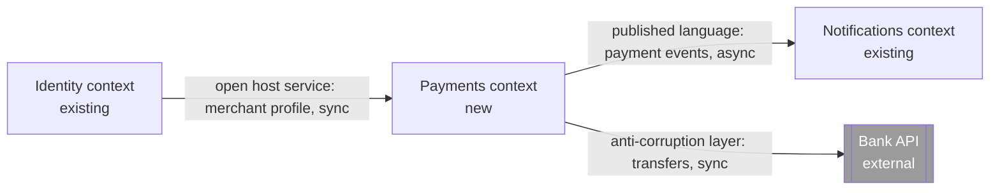
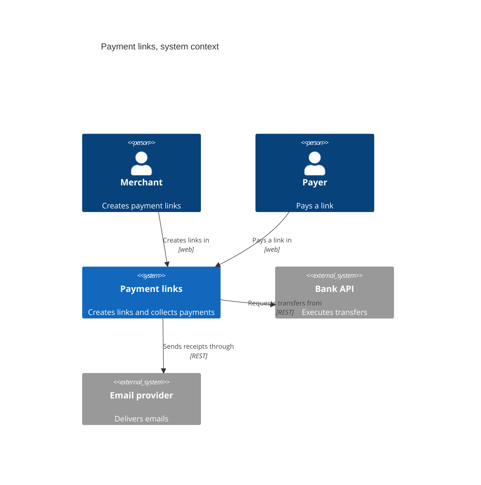

# Context map and C4 notation in Mermaid

Two notations for level 1. Use the flowchart by default. Use `C4Context` when the user
prefers Simon Brown's notation.

## Rules that apply to both (from the C4 model)

- Every arrow is unidirectional and labeled with a verb phrase: "publishes payment
  events to", "reads merchant profile from". Never a bare "uses" or "calls".
- Every external system states what it is.
- Every diagram has a legend or a note that names the pattern of each relationship.
- Context and container level are enough for most teams. Go lower only when asked.

## Flowchart context map



Label format: `<pattern>: <what flows>, <sync or async>`. Arrow direction goes from
upstream to downstream. Upstream is the side that does not change to please the other.

Relationship patterns, one line each:

| Pattern | Meaning |
|---|---|
| Customer-supplier | Downstream asks, upstream plans for it. |
| Conformist | Downstream accepts the upstream model as is. |
| Anti-corruption layer | Downstream translates the upstream model at the boundary. |
| Open host service | Upstream offers a stable protocol for many consumers. |
| Published language | A shared, documented format, often events. |
| Shared kernel | Two contexts share a small model and change it together. |
| Separate ways | No integration. |

## C4Context



`C4Container` follows the same shape with `Container(id, "name", "technology",
"description")` inside `System_Boundary(id, "name") { ... }`. Every container states its
technology.

## In the conversation

```
[Identity] --profile, sync--> [Payments] --events, async--> [Notifications]
                                  |
                          transfers, sync (ACL)
                                  v
                             [[Bank API]]
```
