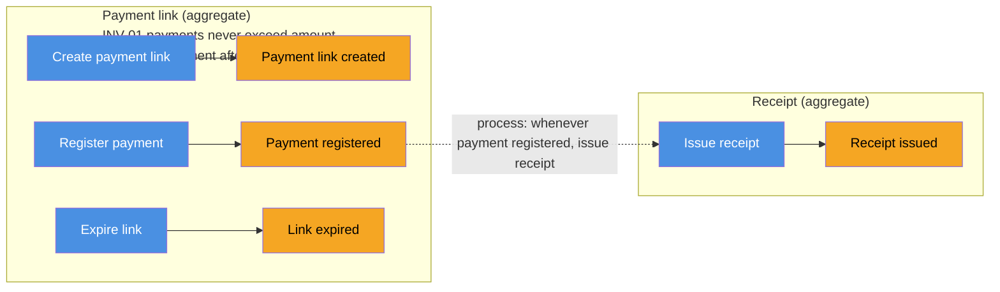
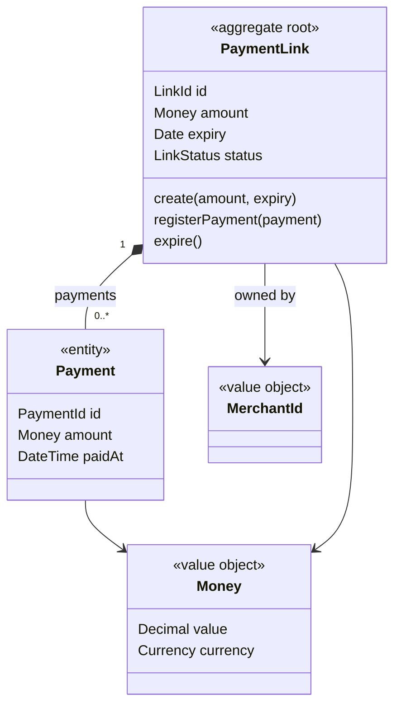
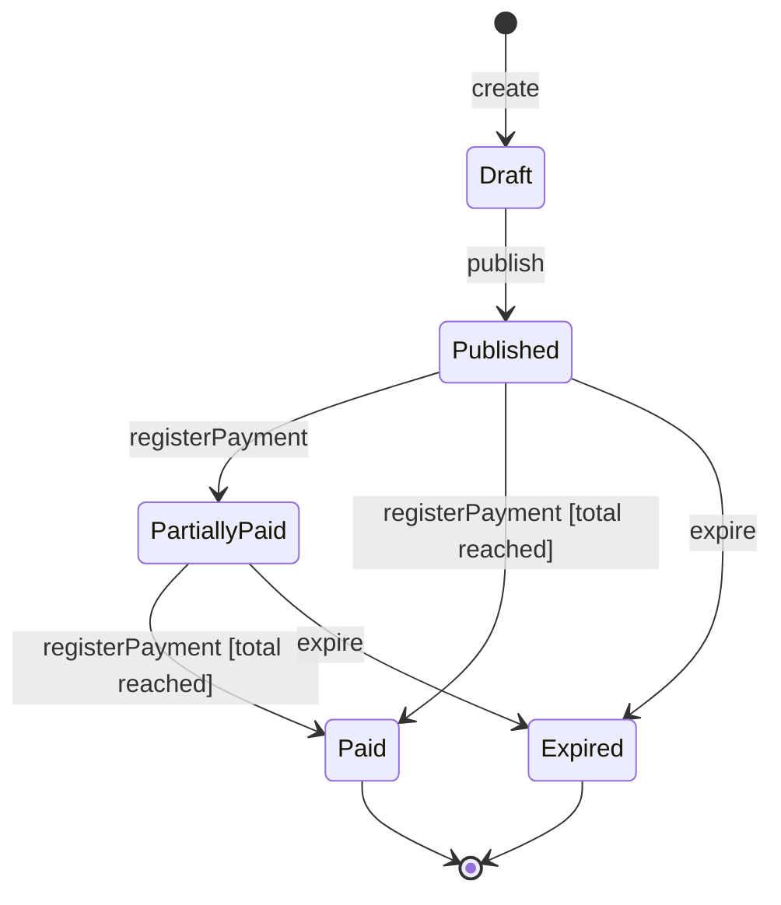
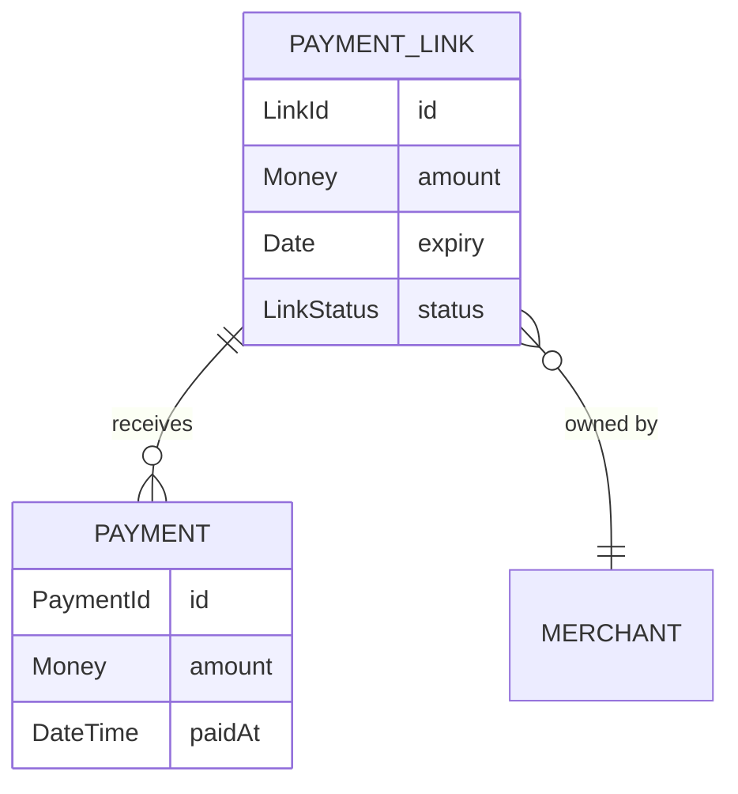

# Aggregates, entities and states in Mermaid

## Level 2: aggregates as subgraphs



A process is a dotted edge from an event of one aggregate to a command of another.

## Level 3: classDiagram per aggregate



Rules:

- Stereotypes: `<<aggregate root>>`, `<<entity>>`, `<<value object>>`.
- Composition `*--` inside the aggregate. A plain arrow with an ID type for a reference to
  another aggregate (`MerchantId`), never the other aggregate's class.
- Attribute types in domain terms: `Money`, `Email`, `Date`, `Percentage`.
- Methods are the commands the root accepts. Optional at this level.

## State machine of a root

States come from the events. Transitions are the commands.



Guards in brackets are invariants. Name them: `[INV-01]`.

## erDiagram, optional

Only for a user who thinks in this notation. It still describes the domain, not the
tables.



## In the conversation

```
PaymentLink (root)  id, amount: Money, expiry: Date, status
  |-- 0..* Payment (entity)  id, amount: Money, paidAt
  |-- MerchantId (reference by ID)
  INV-01 sum(payments.amount) <= amount
  INV-02 no registerPayment after expiry

Draft -create-> Published -registerPayment-> PartiallyPaid -registerPayment[INV-01]-> Paid
                    \-expire-> Expired
```
