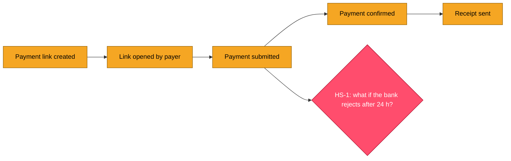
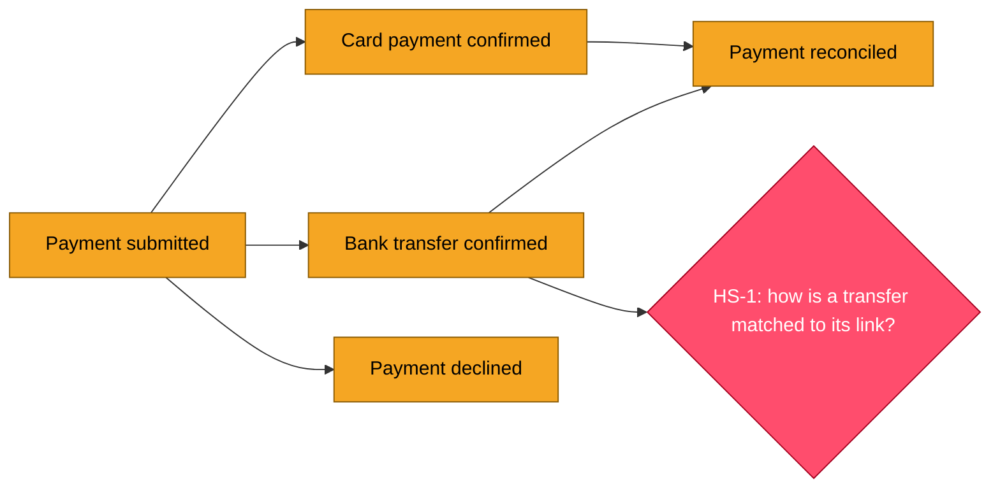
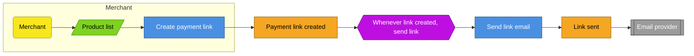

# EventStorming legend for Mermaid

Brandolini's sticky-note colours, as Mermaid classes. Put this block at the end of every
diagram in `01-eventstorming.md`.

```
classDef event fill:#f5a623,stroke:#8a5a00,color:#000
classDef command fill:#4a90e2,stroke:#1f4f8a,color:#fff
classDef actor fill:#f8e71c,stroke:#9a8c00,color:#000
classDef policy fill:#bd10e0,stroke:#6a0a80,color:#fff
classDef readmodel fill:#7ed321,stroke:#3f7a00,color:#000
classDef external fill:#9b9b9b,stroke:#4a4a4a,color:#fff
classDef hotspot fill:#ff4d6d,stroke:#a3001f,color:#fff
classDef new stroke-dasharray:5 5
```

| Element | Colour | Shape | Naming rule | Example |
|---|---|---|---|---|
| Domain event | orange | rectangle `[ ]` | past tense, business words | `Payment link created` |
| Command | blue | rectangle `[ ]` | imperative | `Create payment link` |
| Actor | yellow | rounded `( )` | a role | `Merchant` |
| Policy | purple | hexagon `{{ }}` | "Whenever X, then Y" | `Whenever paid, send receipt` |
| Read model | green | parallelogram `[/ /]` | what the actor looks at | `Pending invoices` |
| External system | grey | double rectangle `[[ ]]` | the system name | `Bank API` |
| Hot spot | pink | diamond `{ }` | a question | `HS-1: partial refunds?` |
| New in this feature | any | dashed border | add class `new` | |

## Level 1 example



## Level 1 with alternative outcomes

Two outcomes of one step branch and rejoin. Failure outcomes are events on the lane.



The `new` class (dashed border) marks the delta on an incremental run only. Omit it on a
first run.

## Level 2 example



## In the conversation

The session does not render Mermaid. Show the timeline as ASCII:

```
[Payment link created] -> [Link opened] -> [Payment submitted] -> [Payment confirmed] -> [Receipt sent]
                                                  |
                                          {HS-1: bank rejects after 24 h?}
```

Write the Mermaid version into the file.
