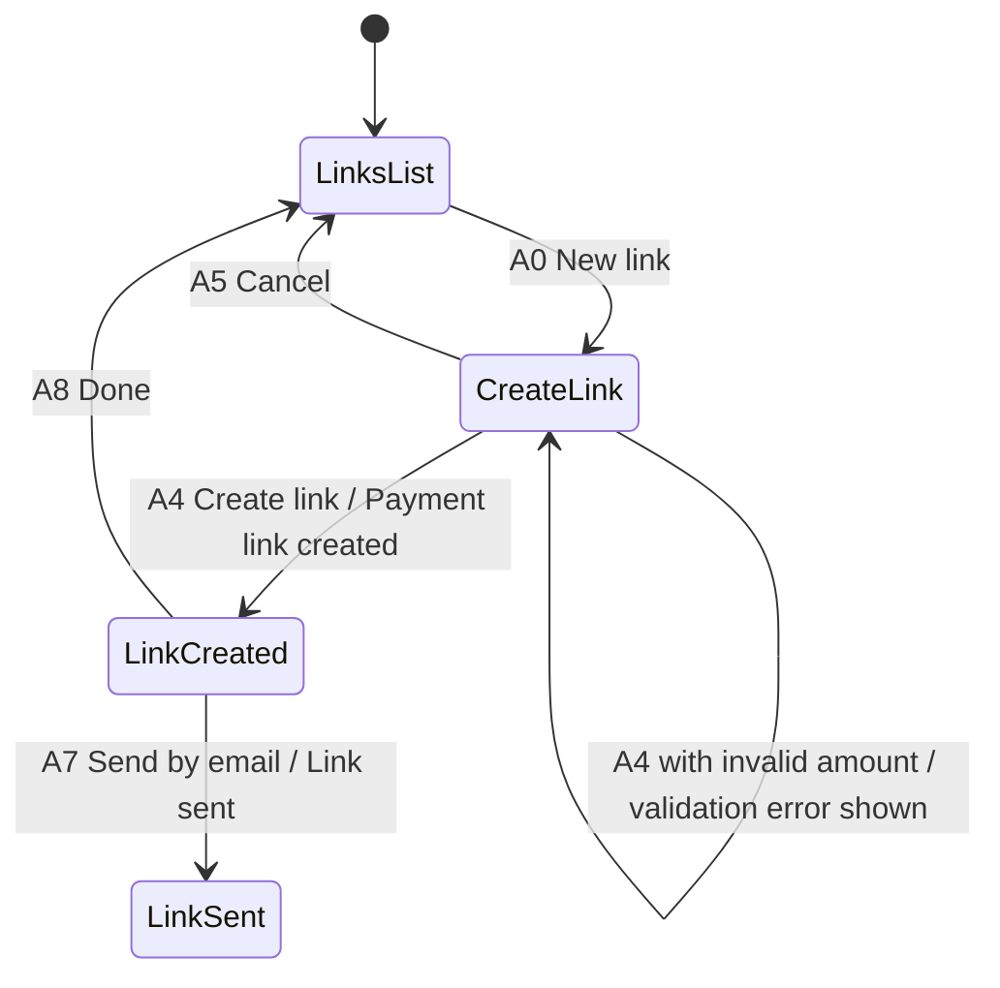
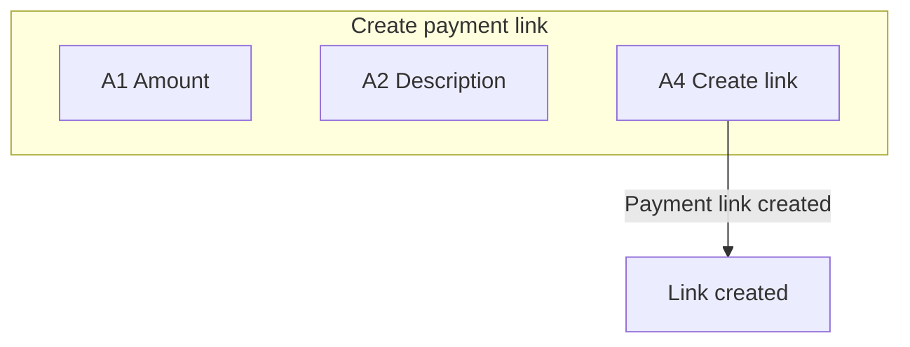
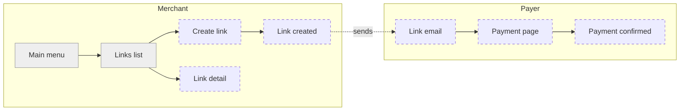

# Breadboarding

Breadboarding comes from Shape Up (Basecamp). It borrows the electronics idea of a circuit
laid out for function, with no case around it. A breadboard shows how a feature works
without showing how it looks.

## Three elements, nothing else

| Element | What it is | Examples |
|---|---|---|
| Place | Somewhere the user can navigate to | a screen, a modal, a wizard step, an email, a push notification, a printed page |
| Affordance | Something the user can act on in a place | a text field, a button, a link, a toggle, a file drop, a row in a list |
| Connection line | An affordance leads the user to a place | "Save" leads to the detail screen; "Cancel" leads back to the list |

Text elements that the user only reads (a title, a total, a status) are affordances too
when they matter to the decision. Write them in the "data shown" list, not as buttons.

## Write it in text first

```
PLACE: Create payment link
  A1  Amount field
  A2  Description field
  A3  Expiry date field
  A4  [Create link]  -> fires "Create payment link" -> "Payment link created" -> PLACE: Link created
  A5  (Cancel)       -> PLACE: Links list

PLACE: Link created
  A6  Copy link
  A7  Send by email  -> fires "Send link" -> PLACE: Link sent confirmation
```

## Then draw it as Mermaid

States are places. Transitions are `affordance / event`.



Use `flowchart TD` with one subgraph per place when the reader needs the list of
affordances inside each place:



## Unhappy paths checklist

Every flow covers at least these. Add the ones the domain needs.

| Path | Question to ask | Usually lands on |
|---|---|---|
| Validation error | What if a required input is missing or invalid? | The same place, error shown |
| Empty state | What does the actor see with no data yet? | The same place, empty variant |
| No permission | What if this actor may not do this? | A blocked variant or the previous place |
| Timeout or external failure | What if the bank, the email provider, the API does not answer? | A retry variant or a pending state |
| Conflict | What if the thing changed while the actor was editing? | A reload prompt |
| Duplicate action | What if the actor presses the primary action twice? | The same result once |

## Screen map: the coarsest breadboard

At level 1 the breadboard has only places and connection lines. Affordances arrive at
level 2.



## In the conversation

Show the breadboard as the text form above, or as a short ASCII chain:

```
[Links list] --A0 New link--> [Create link] --A4 Create / link created--> [Link created]
                                   |                                          |
                              A5 Cancel                                  A7 Send by email
                                   v                                          v
                              [Links list]                              [Link sent]
```
